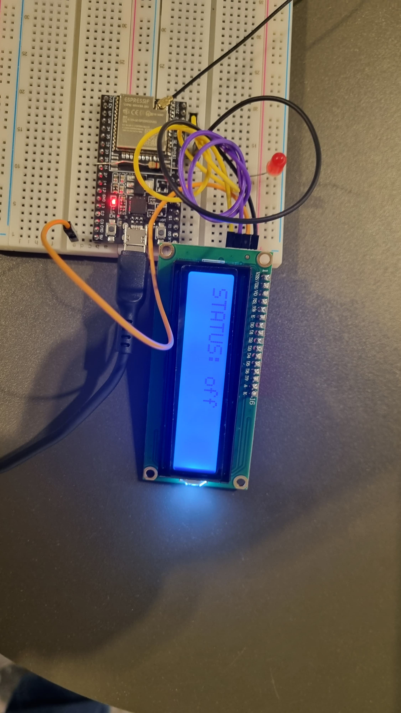

# Documentação IoTDoc - Módulo 4 - Inteli

## Big Mother

#### Nomes dos integrantes do grupo:

Antônio Bahia Fonseca Moraes, Gabriel Coletto Silva, Gabriel Pelinsari, Isabella Fernandes Saldanha, Marcelo Sitton, Vitoria Novaes

## Sumário

[1. Introdução](#c1)

[2. Metodologia](#c2)

[3. Desenvolvimento e Resultados](#c3)

[4. Possibilidades de Descarte](#c4)

[5. Conclusões e Recomendações](#c5)

[6. Referências](#c6)

[7. Anexo](#c7)

 

# 1. Introdução

&emsp;&emsp; O Hospital Sírio-Libanês é um dos mais importantes hospitais do Brasil e da América Latina. Fundado em 1921 pela comunidade sírio-libanesa de São Paulo, o hospital é administrado pela Sociedade Beneficente de Senhoras até hoje. O hospital é referência em tratamento de câncer de mama, reprodução assistida, cardiologia, oncologia, entre outras especialidades. O hospital conta com mais de 50 mil m² de área construída, 172 leitos, 10 consultórios médicos, 6 salas de centro cirúrgico, além de um centro de diagnósticos, um centro de oncologia e um centro de imunização.

## 1.1. Objetivos

&emsp;&emsp;No tocante aos objetivos, o Hospital Sírio-Libanês visa principalmente prestar assistência médica de excelência, pautando-se em valores como humanização, ética e inovação. Especificamente em relação à tecnologia, a instituição almeja aprimorar a segurança e a qualidade do atendimento aos pacientes, proporcionando um monitoramento em tempo real de sua localização e status enquanto estão nas dependências do hospital. Ademais, busca-se otimizar a gestão de recursos humanos e materiais, através do rastreamento dos médicos e equipamentos, além de integrar os dados dos pacientes aos sistemas de informação do hospital e do Sistema Único de Saúde (SUS), visando facilitar o acesso e a partilha de informações.

## 1.2. Proposta de Solução

&emsp;&emsp;A solução proposta envolve o desenvolvimento de um dispositivo vestível, destinado ao uso tanto por pacientes quanto por médicos. Esse dispositivo seria composto por um chip para armazenamento de dados do paciente, um localizador para acompanhamento dentro do hospital, um botão de emergência e uma bateria recarregável com duração de até 24 horas. A comunicação se daria de forma sem fio com uma plataforma online, responsável por coletar e analisar os dados, além de ser capaz de enviar alertas para médicos, mostrar a localização de pacientes e profissionais no mapa do hospital, gerar relatórios sobre o estado clínico dos pacientes e o desempenho dos médicos, e integrar os dados com os sistemas do hospital e do SUS. Esta solução visa prover mais segurança e qualidade para os pacientes, aumentar a eficiência e produtividade dos médicos e promover maior integração e inovação para o hospital.

## 1.3. Justificativa

&emsp;&emsp;A proposta se justifica ao atender os objetivos gerais e específicos do Hospital Sírio-Libanês, contribuir para melhorias em assistência médica, educação e pesquisa na área da saúde, além de promover o desenvolvimento social e econômico do país. Baseia-se em tecnologias já existentes e testadas no mercado, se diferencia por ser personalizada para as necessidades do hospital e tem potencial para gerar benefícios diversos, tais como aumento da satisfação, redução do tempo de espera, diminuição dos custos operacionais, melhoria da qualidade de vida e redução da mortalidade.

## 1.4. Contexto da indústria (principais players, modelos de negócio, tendências)

&emsp;&emsp;O setor hospitalar brasileiro, composto por hospitais públicos e privados, atende tanto a pacientes do SUS quanto a pacientes de planos de saúde. Em 2022, o Brasil contava com 7.488 hospitais, distribuídos em 37% públicos e 63% privados, totalizando 461.878 leitos hospitalares e 223.155 salas de cirurgia. A concorrência é particularmente intensa entre os hospitais privados, que disputam tanto clientes de planos de saúde quanto clientes particulares. O Hospital Sírio-Libanês tem como principais competidores o Hospital Albert Einstein, o Hospital Oswaldo Cruz e o Hospital Samaritano. O modelo de negócio do setor se baseia na prestação de serviços médicos, remunerados diretamente pelo paciente ou indiretamente por meio do SUS ou planos de saúde, e as principais tendências do setor incluem a expansão da rede hospitalar, a digitalização dos processos e a humanização do atendimento.

# 2. Metodologia

&emsp;&emsp;Com o propósito de aumentar a eficiência da estrutura organizacional de projetos, proporcionando um suporte ainda mais efetivo para as atividades incorporadas na solução proposta pelo grupo Big Mother, a decisão recaiu sobre a adoção do modelo RM-ODP (Reference Model for Open Distributed Processing). Esta escolha se baseia em um modelo de referência com uma alta aplicabilidade, que estabelece padrões para a concepção de sistemas com enfoque em aplicações destinadas a produtos IoT.

&emsp;&emsp;Ao adotar o sistema RM-ODP, consolida-se uma plataforma para a arquitetura do projeto, o que facilita na simplificação da compreensão e na interação entre os múltiplos componentes do sistema desenvolvido. Além disso, o modelo disponibiliza um repertório de conceitos uniformizados, facilitando a criação de uma documentação que auxilia nas decisões tomadas. Para chegar a decisão desse modelo, foi necessário adquirir conhecimento à respeito de Brian Randell, uma referência e renomado cientista da computação que ficou conhecido por suas contribuições para a teoria e prática de sistemas de software, contribuiu significativamente para a teoria e prática do modelo RM-ODP, e suas pesquisas puderam fornecer visões valiosas para a aplicação bem-sucedida desta metodologia.

&emsp;&emsp;Para aplicar a metodologia RM-ODP ao projeto, o grupo seguiu as orientações propostas pelo modelo de referência, que consiste em cinco visões diferentes, cada uma com um propósito e um nível de abstração específicos. Essas visões são: a visão empresarial, a visão de informação, a visão computacional, a visão de engenharia e a visão de tecnologia. Cada uma dessas visões representa um aspecto do sistema que está sendo desenvolvida, e ajuda a definir os requisitos, as funcionalidades, as estruturas, os componentes e as interações do produto. A seguir, será explicado como foi delimitada cada etapa da metodologia aplicada, mostrando os pontos importantes consideradas em cada visão.

**Visão Empresarial:** Nesta fase, foi adotada uma abordagem da Metodologia RM-ODP para analisar os objetivos, estratégias e processos operacionais do produto. Enfoca-se na demonstração dos requisitos comerciais e de hardware através do desenvolvimento pelo Grupo de Requisitos Funcionais, alinhando o projeto com a arquitetura e estratégia organizacional. Foram, também, definidos os objetivos da instituição, garantindo seu alinhamento com a solução proposta de rastreamento hospitalar. Por conseguinte, foi realizada uma análise dos processos de negócios afetados pela solução por meio de, principalmente, análise SWOT, Canvas Proposta de Valor, Matriz de Riscos e 5 Forças de Porter, identificando alterações, interações e dependências mútuas, avaliando como a solução pode otimizar esses processos.

**Visão Tecnológica:** Neste ponto, foi conduzida uma avaliação das tecnologias e padrões disponíveis para o sistema distribuído, como a possível utilização de ESP 32 e outras tecnologias ou a utilização de RFID. Foram analisadas as opções de infraestrutura de rede, protocolos de comunicação (MQTT), serviços de segurança e outras tecnologias relevantes. O objetivo é assegurar a viabilidade e eficácia do sistema, considerando a integração com a proposta de rastreamento hospitalar.

**Visão Computacional:** A perspectiva de Visão Computacional concentra-se na identificação dos aspectos relacionados ao suporte do sistema, abrangendo dimensões de hardware, software e comunicação. Nesta etapa, foram definidas as plataformas de hardware necessárias, como o ESP 32 e componentes correlatos. Além disso, um ponto crucial a se considerar são os requisitos específicos de software para cada plataforma e os protocolos de comunicação a serem utilizados, neste caso, o MQTT, alinhados à proposta de dispositivos vestíveis e monitoramento em tempo real.

**Visão de Engenharia:** A abordagem dessa metodologia na visão de Engenharia inclui elementos relativos ao projeto e desenvolvimento do sistema distribuído de rastreamento hospitalar. Foram delimitados os componentes, módulos, interfaces e serviços necessários, como no tópico de Bill Of Materials e Ubidots. Além disso, estabeleceram-se metodologias de desenvolvimento e implementação, integrando as características específicas do dispositivo proposto.

**Visão da Informação:** Inicia-se uma análise dos requisitos e da gestão das informações fundamentais para o funcionamento eficiente do sistema distribuído. Nesse contexto, foram examinados os requisitos e a gestão das informações essenciais para o eficiente funcionamento do sistema distribuído, identificando estruturas de dados, formatos de dados, interfaces e mecanismos de gerenciamento de informações. Essa análise leva em consideração a integração dos dados dos pacientes aos sistemas hospitalares.

&emsp;&emsp;Portanto, a implementação da Metodologia RM-ODP no projeto efetuado pelo Grupo Big Mother desempenha uma função importante ao fornecer uma estrutura abrangente para o desenvolvimento do sistema. Ao adotar abordagens como User Stories e Requisitos Funcionais na fase de Visão Empresarial, a metodologia contribui para uma compreensão detalhada das necessidades do projeto, garantindo alinhamento eficaz com os objetivos da instituição. A análise dos processos de negócios, facilitada por essa metodologia, não só identifica interações de forma abrangente, mas também estabelece um alicerce para otimizações futuras. Por último, a Metodologia RM-ODP não apenas aumenta a precisão no entendimento do sistema distribuído, mas também fortalece a comunicação entre as partes interessadas do projeto inteiro, o que garante uma implementação eficiente que atenda às expectativas do hospital.

# 3. Desenvolvimento e Resultados

## 3.1. Domínio de Fundamentos de Negócio

### 3.1.1. Contexto da Indústria

&emsp;&emsp;No setor de saúde, o Hospital Sírio-Libanês enfrenta a concorrência de várias instituições de saúde de renome, como o Hospital Israelita Albert Einstein, o Hospital das Clínicas da Faculdade de Medicina da USP (HCFMUSP) e o Hospital Alemão Oswaldo Cruz. Cada um desses competidores representa um risco devido à sua reputação estabelecida, infraestrutura de alta qualidade e capacidade de atrair pacientes em busca de serviços médicos de excelência. O Albert Einstein é conhecido por suas inovações e atraindo profissionais de saúde de alto calibre, o HCFMUSP oferece serviços acessíveis e uma ampla rede de especialistas, enquanto o Oswaldo Cruz se destaca na medicina de precisão. O Sírio-Libanês deve buscar diferenciação por meio de inovações e parcerias estratégicas para se manter competitivo nesse mercado desafiador. Com isso, a competição se baseia na qualidade do atendimento, infraestrutura, especialização médica e pesquisa.

&emsp;&emsp;Então, o modelo do hospital é focado em ofecer serviços de saúde de alta qualidade, com uma abordagem multiaplicada para atendimento médico, pesquisa, educação e inovação. Além de oferecer tratamento médico avançado, o hospital se destaca pelo foco na pesquisa clínica e na formação de profissionais de saúde, através de treinamentos e preparações internas. O Sírio-Libanês também busca parcerias estratégicas com empresas e outras instituições de saúde para expandir seus serviços e inovações no campo da medicina.

&emsp;&emsp;Percebe-se que o setor de saúde está passando por muitas transformações, focando na digitalização e na tecnologia IoT. Tendências atuais incluem a adoção de sistemas de informação e telemedicina para melhorar a eficiência dos cuidados de saúde, o uso de dispositivos IoT para monitorar pacientes remotamente e aprimorar diagnósticos, bem como a implementação de inteligência artificial para auxiliar médicos no diagnóstico e tratamento. Outro ponto importânte para análise é a pandemia de COVID-19, que acelerou a aceitação de medicina tecnológica e soluções de saúde remotas, o que representa uma oportunidade para o Hospital expandir seus serviços e aprimorar o atendimento ao paciente. 

**5 forças de Porter**

&emsp;&emsp;As Cinco Forças de Porter representam uma ferramenta essencial para avaliar o ambiente competitivo de um produto. Esse conceito foi introduzido pelo renomado economista Michael Porter em 1979 e tem sido amplamente utilizado em estratégias empresariais e no planejamento de investimentos. A análise das Cinco Forças permite avaliar o potencial de lucro de uma indústria e a posição estratégica de uma empresa dentro desse contexto. Nesse sentido, foram utilizados desses recursos para o desenvolvimento da seguinte análise do Hospital Sírio-Libanês:

**
 Figura 1** - 5 Forças de Porter 

  

 Elaboração Big Mother 

**Ameaça de produtos substitutos:** Considerando a alta gama de produtos relacionados a tratamento de pacientes presentes no mercado, essa ameaça pode ser interpretada como alta. O Sírio-Libanês pode ser substituído quando seus clientes optarem por outros hospitais particulares, hospitais públicos e até mesmo clínicas e consultórios médicos. Apesar disso, a empresa tem uma forte atuação no mercado, já sendo bem estabelecida. Ainda assim, para reduzir ainda mais essa ameaça, o hospital pode continuar investindo no aprimoramento do seu serviço, como a automatização do processo de triagem e monitoramento dos pacientes e funcionários.

**Ameaça de novos entrantes:** Essa ameaça pode ser considerada como moderada para o Sírio-Libanês. Isto se deve, em grande parte, à complexidade do setor de prestação de serviços de saúde, seja por questões custeadas ou por questões de regulamentação e acordos com planos de saúde. Porém, as clínicas especializadas, por serem tipicamente de menor porte em comparação com grandes hospitais, apresentam barreiras de entrada menos desafiadoras para possíveis produtos ou serviços substitutos, representando uma possível ameaça para a empresa.

**Poder de negociação dos clientes:** Os clientes do Hospital-Sirio Libanes detém grande poder de negociação, tornando essa ameaça alta. A reputação do hospital desempenha um papel fundamental na redução do risco de perda de pacientes para concorrentes. No entanto, é importante reconhecer que os clientes com planos de saúde têm uma ampla gama de opções de hospitais à sua disposição e podem escolher outros estabelecimentos caso não estejam satisfeitos. Além disso, os pacientes cobertos por seguros de saúde exercem uma influência substancial sobre o hospital, uma vez que representam uma parcela significativa da clientela. Portanto, o hospital deve estar atento às diretrizes, contratos e regulamentações associados a essas terceirizações para garantir a satisfação do cliente e retenção dos mesmos.

**Poder de negociação dos fornecedores:** O poder de negociação dos fornecedores no setor hospitalar pode ser estabelecido como alto, uma vez que a empresa é dependente de fornecedores de tecnologia, equipamentos médicos e matérias-primas para suas operações. Uma possível falta de suprimentos médicos ou encarecimento dos mesmos poderia afetar toda a cadeia da empresa, trazendo grandes prejuízos. Portanto, é crucial para o hospital estabelecer relações sólidas e estratégicas com seus fornecedores para garantir o fornecimento contínuo e eficiente de recursos essenciais.

**Rivalidade entre concorrentes:** A rivalidade entre concorrentes pode ser considerada como alta, tendo em vista a existência de grandes hospitais particulares bem estabelecidos como Hospital Israelita Albert Einstein, Samaritano e Alemão Oswaldo Cruz. Apesar disso, devido a sua reputação, história e preocupação com a implementação de tecnologias e melhorias no serviço, o hospital consegue se destacar em relação à concorrência.

**
 Figura 2** - 5 Forças de Porter 

  

 Elaboração: Big Mother 

&emsp;&emsp;Portanto, conclui-se que a concorrência para o Hospital Sírio-Libanês vem se estabelecendo como alta, visto que os concorrentes do hospital englobam desde hospitais particulares até mesmo clínicas de medicina complementar. Isso estabelece a necessidade da empresa de se manter firme em sua reputação, investindo em inovação e tecnologia para se afastar cada vez mais dos concorrentes, destacando aqui a importância do papel desempenhado pela Alma Sírio-Libanês, que busca acelerar o desenvolvimento e a incorporação de novas tecnologias.

### 3.1.2. Análise SWOT

&emsp;&emsp;A Análise SWOT (Strengths, Weaknesses, Opportunities and Threats), também conhecida como FOFA (Forças, Fraquezas , Oportunidades e Ameaças), é uma ferramenta fundamental de planejamento estratégico amplamente utilizada para auxiliar indivíduos e organizações a identificar elementos críticos relacionados à sua posição competitiva nos negócios ou ao planejamento de projetos.

&emsp;&emsp;As "Weaknesses" (Fraquezas) representam as áreas internas que precisam de melhorias, como deficiências operacionais ou recursos insuficientes. As "Opportunities" (Oportunidades) apontam para fatores externos favoráveis que podem ser aproveitados para o crescimento ou sucesso, como tendências de mercado ou novas tecnologias. Por fim, as "Threats" (Ameaças) envolvem fatores externos negativos, como concorrência intensa, mudanças regulatórias ou crises econômicas, que podem prejudicar a posição da organização. Juntos, esses quatro elementos ajudam a orientar estratégias e decisões para maximizar os pontos fortes, minimizar as fraquezas, aproveitar as oportunidades e enfrentar as ameaças. Neste contexto, utilizando dessas ferramentas e técnicas, é apresentada uma análise abrangente do Hospital Sírio-Libanês, destacando suas principais forças, fraquezas, oportunidades e ameaças.

**Forças:**

- **Referência em Especialidades Médicas:** O hospital é referência em várias especialidades médicas, como tratamento de câncer de mama, reprodução assistida, cardiologia e oncologia.
- **Infraestrutura Robusta:** Mais de 50 mil m² de área construída, com leitos, consultórios médicos e salas de centro cirúrgico bem equipadas.
- **Inovação e Tecnologia:** O hospital demonstra um forte compromisso com a inovação tecnológica, visando aprimorar a segurança e a qualidade do atendimento.
- **Gestão e Integração de Dados:** Busca a integração de dados dos pacientes com os sistemas do hospital e do SUS.
- **História e Reputação:** Fundado em 1921 e administrado por uma sociedade beneficente reconhecida, o hospital tem uma longa história e uma sólida reputação.

**Fraquezas:**

- **Alta Concorrência:** Confronto direto com outras instituições de renome como Albert Einstein e Hospital das Clínicas da FMUSP.
- **Dependência de Inovações Tecnológicas:** A proposta de solução depende fortemente do sucesso da implementação de dispositivos vestíveis e integração de sistemas.
- **Complexidade Operacional:** Gerenciar a infraestrutura e a tecnologia envolvida pode ser complexo e suscetível a erros operacionais.

**Oportunidades:**

- **Expansão da Telemedicina:** A pandemia acelerou a aceitação da telemedicina, que pode ser uma área de crescimento para o hospital.
- **Parcerias Estratégicas:** Potencial para formar parcerias com empresas de tecnologia e outras instituições para expandir serviços.
- **Digitalização do Setor de Saúde:** A tendência de digitalização oferece oportunidades para inovação e melhoria da eficiência.

**Ameaças:**

- **Evolução Rápida da Tecnologia:** A necessidade de atualização contínua pode ser um desafio devido à rápida evolução tecnológica.
- **Instabilidade Econômica:** As flutuações econômicas podem impactar a capacidade dos pacientes de acessar serviços privados de saúde.
- **Desafios Regulatórios:** Mudanças na regulamentação do setor de saúde e em políticas do SUS podem afetar as operações.

&emsp;&emsp;Para um projeto de IoT voltado ao controle de fluxo no Hospital Sírio-Libanês, é importante destacar que as ameaças assumem uma posição central na análise, já que esse tipo de iniciativa está sujeito a mudanças no ambiente de saúde, o que inclui crises, como epidemias, que podem impactar significativamente a demanda e operação do hospital. Além disso, a segurança cibernética deve ser uma prioridade, dado o potencial de ataques que possam comprometer dados sensíveis. Por outro lado, as forças do hospital, como sua reputação renomada e excelência em pesquisa, têm o potencial de fortalecer a imagem da instituição e reforçar sua posição como pioneira em inovação, tornando a implementação de um projeto IoT importante não apenas em termos operacionais, mas também na promoção da marca como um todo. Mesmo que as fraquezas e oportunidades desempenhem papéis importantes, as ameaças e as forças emergem como os principais fatores a serem considerados no desenvolvimento desse projeto.

### 3.1.3. Descrição da Solução a ser Desenvolvida

&emsp;&emsp;A solução proposta consiste no desenvolvimento de um dispositivo vestível destinado a pacientes e médicos. Para os pacientes, o dispositivo seria uma pulseira inteligente, equipada com sensores e um sistema de GPS para rastrear a localização do paciente dentro do hospital. Adicionalmente, a pulseira conta com um botão de emergência, permitindo uma comunicação imediata em situações críticas. Para a equipe médica, o dispositivo seria um sensor com GPS integrado em seus crachás de identificação, o que possibilita a localização em tempo real dos médicos dentro do hospital. Adicionalmente, os dispositivos se comunicariam sem fio com uma plataforma online que coleta, analisa e centraliza os dados dos pacientes e dos médicos, para que um sistema de fluxo seja construído.

#### 3.1.3.1 Qual é o problema a ser resolvido

&emsp;&emsp;O desafio identificado por nosso parceiro de negócios está relacionado à falta de eficiência na gestão do fluxo de pacientes no pronto atendimento. Além de complexo, o fluxo hospitalar requer uma gestão ágil do tempo e movimento, envolvendo a priorização e reorganização de consultas e exames para pacientes. Diante da situação apresentada, o grupo entendeu que a problemática também se estende à equipe médica, que exerce um papel fundamental na resposta a situações de emergência, como traumas e paradas cardíacas. Em situações como essas, a pronta prestação de cuidados médicos é crucial, com a gestão precisa do tempo e do percurso até o leito sendo de importância crítica. Essa assistência rápida demanda a obtenção de dados precisos acerca da localização, tanto do paciente quanto da equipe médica, e a ausência desses dados pode resultar em atrasos críticos, aumentando o risco de complicações e ameaçando vidas.

#### 3.1.3.2 Qual a solução proposta (visão de negócios)

&emsp;&emsp;Sob uma perspectiva de negócios, os dispositivos vestíveis com a utilização de uma plataforma online centralizadora promete aprimorar a eficiência operacional em hospitais, fortalecendo a reputação da instituição, abrindo oportunidades para diferenciação no mercado e gerando receitas adicionais, ao oferecer monitoramento de sinais vitais e localização em tempo real como serviço. A gestão de recursos otimizada e uma resposta mais eficaz em situações críticas podem reduzir custos operacionais e aumentar a utilização eficaz do tempo da equipe médica, proporcionando um impacto positivo no desempenho financeiro da instituição.

#### 3.1.3.3 Como a solução proposta deverá ser utilizada

&emsp;&emsp;A utilização da solução é simples e intuitiva, os pacientes devem usar as pulseiras inteligentes fornecidas no momento da chegada ao hospital, garantindo que estejam corretamente ajustadas. Os sensores de sinais vitais da pulseira funcionam automaticamente, e o GPS rastreia sua localização no hospital em tempo real. Em caso de emergência, os pacientes podem acionar o botão de emergência para notificar imediatamente a equipe médica. Os médicos e profissionais de saúde devem usar os sensores integrados em seus crachás de identificação durante seu turno de trabalho. O sistema de GPS nos crachás permite que a equipe médica seja localizada com precisão em relação aos pacientes, garantindo uma resposta mais eficiente em situações críticas. Todos esses dados coletados serão mostrados em uma plataforma online, onde a equipe assistencial poderá gerar o fluxo de médicos e pacientes através do envio de alertas para os médicos mais próximos quando um paciente apresenta sinais de deterioração ou aciona o botão de emergência e gerar relatórios sobre o estado clínico dos pacientes e o desempenho dos médicos.

#### 3.1.3.4 Quais os benefícios trazidos pela solução proposta

&emsp;&emsp;A implementação da solução proposta trará a otimização da gestão do fluxo de pacientes. Em primeiro lugar, a localização e o acesso às informações dos pacientes em tempo real otimiza a alocação de recursos e agiliza a assistência em casos de emergência, melhorando a eficiência e produtividade da equipe. Além disso, a integração e centralização desses dados proporcionaria uma gestão mais eficiente do tempo, reduzindo riscos e potencialmente salvando vidas, ao mesmo tempo em que aprimora a experiência do paciente no ambiente hospitalar.

#### 3.1.3.5 Qual será o critério de sucesso e qual medida será utilizada para o avaliar

&emsp;&emsp;Os critérios de sucesso da solução incluem a precisão na monitorização dos pacientes, uma resposta ágil em emergências, a otimização do fluxo de pacientes, integração eficaz com sistemas hospitalares, redução de custos operacionais, aumento da eficiência da equipe médica e alta aceitação tanto por pacientes quanto por profissionais de saúde. Os critérios de sucesso serão avaliados por meio de métricas e indicadores específicos, como a redução do tempo de espera dos pacientes, a eficiência operacional medida pela redução de custos, a melhoria no uso do tempo da equipe médica e pesquisas de satisfação com pacientes e profissionais de saúde. Estes dados serão analisados regularmente para garantir o alcance dos objetivos da solução.

### 3.1.4. Value Proposition Canvas

&emsp;&emsp;O Value Proposition Canvas, criado por Alexander Osterwalder e Yves Pigneur, é uma ferramenta que auxilia empresas a alinhar suas propostas de valor às reais necessidades e desejos de seus clientes. Dividido entre o perfil do cliente e a proposta de valor, permite uma compreensão profunda das dores e ganhos do cliente, facilitando a criação de produtos e serviços mais alinhados e relevantes para o mercado. É apresentado a seguir um desenvolvimento de Value Proposition Canvas com base no projeto do grupo Big Mother.

 Figura 4 - Canvas Value Proposition 

  

Elaboração Big Mother

#### Perfil do Cliente

##### Tarefas

Os clientes do Hospital Sírio-Libanês são compostos por pacientes e médicos, que buscam:

- **Pacientes**:
  - Receber atendimento médico de qualidade.
  - Serem atendidos com segurança, rapidez e conforto.
- **Médicos**:
  - Prestar assistência médica de excelência.
  - Atuar com eficiência, produtividade e inovação.
- **Intermediador**:
  - Acessar informações clínicas dos pacientes em tempo real.
  - Integrar os dados dos pacientes com os sistemas do hospital.

##### Dores

Dificuldades enfrentadas ao realizar as tarefas:

- **Pacientes**:
  - Demora no atendimento.
  - Falta de monitoramento contínuo.
  - Risco de erros médicos.
  - Perda de dados clínicos.
- **Médicos**:
  - Escassez de recursos humanos e materiais.
  - Dificuldade de acesso às informações dos pacientes.
  - Falta de integração dos dados.

##### Ganhos

Benefícios esperados:

- **Pacientes**:
  - Mais segurança e qualidade no atendimento.
  - Conforto e privacidade no hospital.
  - Melhoria na qualidade de vida.
- **Médicos**:
  - Eficiência e produtividade na assistência.
  - Acesso e integração das informações.
  - Inovação e pesquisa na área da saúde.

#### Proposta de Valor

##### Produtos e Serviços

Nossa solução é um dispositivo vestível integrado a uma plataforma online:

- Armazenamento de dados do paciente.
- Sistema de localização no hospital.
- Botão de emergência.

##### Aliviadores de Dor

Como o nosso produto minimiza as dificuldades:

- Alerta imediato para médicos próximos em caso de sinais críticos ou emergências.
- Gestão otimizada de localização de pacientes, médicos e equipamentos no hospital.

##### Criadores de Ganho

Como nosso produto amplifica os benefícios:

- Acesso em tempo real aos dados clínicos.
- Integração fácil com sistemas hospitalares.
- Incentivo à pesquisa científica e geração de relatórios úteis.

&emsp;&emsp;Nossa proposta de valor foca nas necessidades essenciais de pacientes e médicos no ambiente hospitalar. Oferecemos um dispositivo vestível que monitora e centraliza dados clínicos, garantindo acesso imediato para profissionais de saúde. Este sistema não só assegura respostas rápidas em emergências, mas também otimiza a gestão hospitalar, elevando a segurança do paciente e a eficiência médica.

&emsp;&emsp;Com essa análise destaca-se dois pontos muito importantes: A capacidade de acessar informações clínicas dos pacientes em tempo real e a resolução da falta de integração dos dados. A possibilidade de acessar informações clínicas em tempo real garante que os profissionais possam tomar decisões embasadas em dados atualizados, muito importante em situações críticas. Isso resulta em atendimentos mais seguros para os pacientes. Além disso, a integração de dados é um desafio comum em ambientes hospitalares, no qual informações frequentemente se encontram dispersas em sistemas diversos. Ao endereçar essa questão, o projeto viabiliza o acesso rápido e preciso a dados essenciais, contribuindo para a otimização dos processos e uma assistência médica mais eficiente. A integração de dados também possui um papel importante na diminuição de erros médicos, no aproveitamento de recursos e na geração de pontos para melhorar a qualidade dos serviços de saúde.

### 3.1.5. Matriz de Riscos

&emsp;&emsp;A análise e gestão de riscos em qualquer projeto é essencial para o entendimento e planejamento do negócio, como destacado pelo especialista em gestão David Hillson em seu livro "Effective Opportunity Management: Through the Project Risk Management Lens". Uma matriz de riscos bem estruturada é fundamental para permitir a identificação e priorização das ameaças mais perigosas, facilitando a prevenção delas. Dessa forma, é possível conter potenciais impactos adversos e garantir a eficiência do projeto. A utilização da matriz de risco possibilita uma visão organizada dos riscos do projeto, promovendo a minimização de potenciais adversidades.

 Figura 5 - Matriz de Riscos 

 Elaboração Big Mother 

&emsp;&emsp;Destaca-se na análise da matriz de riscos a importância crítica de dois elementos específicos. Primeiramente, a possibilidade de a solução final não atender às expectativas do cliente, que é um risco fundamental. O sucesso do projeto está totalmente ligado à satisfação e aprovação do cliente, tornando essencial o acompanhamento constante das suas necessidades. Além disso, a falha na precisão dos dispositivos representa outro risco crítico, pois o projeto de IoT no hospital depende de informações precisas para aprimorar o fluxo de pacientes e médicos. Qualquer imprecisão pode comprometer a eficácia do sistema, resultando em decisões errôneas e potencialmente colocando em risco o tempo dos pacientes e médicos. No entanto, é crucial ressaltar que os demais riscos listados na matriz também são de extrema importância e não devem ser subestimados, uma vez que sua gestão adequada é vital para o sucesso global do empreendimento.

### 3.1.6. Política de Privacidade de acordo com a LGPD

&emsp;&emsp;A política de privacidade é um documento que explica como os dados são coletados, armazenados, processados e com quem são compartilhados. Ele é de grande importância para qualquer empresa que lida com informações pessoais. O documento tem como objetivo preservar a privacidade dos usuários e mantê-los informados sobre o tratamento de suas informações. A seção atual tem como propósito explicar a política de privacidade do projeto. Para obter informações mais detalhadas, é possível ler a política completa na seção de anexos.

#### 3.1.6.1 Informações gerais sobre a empresa / organização

&emsp;&emsp;O Hospital Sírio-Libanês - Sociedade Beneficente de Senhoras Hospital Sírio Libanês, doravante denominada simplesmente como Hospital Sírio-Libanês e/ou Alma Sírio-Libanês, inscrita no CNPJ/MF sob o nº 61.590.410/0001-24, no papel de Controladora de Dados, obriga-se ao disposto na presente Política de Privacidade.

#### 3.1.6.2 Informações sobre o tratamento de dados

&emsp;&emsp;O Alma Sírio-Libanês recolhe dados pessoais dos usuários que os fornecem voluntariamente quando utilizam seus serviços de saúde. A empresa também coleta dados por meio de cookies e tecnologias semelhantes.

#### 3.1.6.3 Quais são os dados coletados

&emsp;&emsp;Os dados pessoais coletados podem incluir informações inseridas ativamente pelo usuário no momento de cadastro e, ainda informações coletadas automaticamente, quando da utilização do website e páginas relacionadas. Entre os dados coletados estão informações de contato, informações médicas, qualquer informação adicional fornecida voluntariamente pelos usuários. Além disso, a empresa coleta dados de cookies e tecnologias semelhantes, como endereços IP, idioma preferencial, número de visitantes do site, páginas visitadas, dados de localização e interações com o site.

#### 3.1.6.4 Onde os dados são coletados

&emsp;&emsp;Os dados são coletados diretamente dos usuários quando eles fornecem informações por meio do site, do hospital físico ou interagem com o site usando cookies e tecnologias semelhantes.

#### 3.1.6.5 Para quais finalidades os dados serão utilizadas

&emsp;&emsp;Os dados coletados são usados para várias finalidades, principalmente analises médicas, projetos de inovação na área da saúde e personalizar a experiência do usuário.

#### 3.1.6.6 Onde os dados ficam armazenados

&emsp;&emsp;Os dados pessoais são armazenados de forma segura pela empresa. O Alma Sírio-Libanês é uma empresa consolidada e os dados podem ser armazenados ou transferidos para outras empresas parceiras. Provedores de serviços terceirizados também podem ser usados para hospedar webcasts e oferecer suporte técnico.

#### 3.1.6.7 Qual o período de armazenamento dos dados (retenção)

&emsp;&emsp;A empresa conserva os dados pessoais durante o tempo necessário para cumprir as finalidades para as quais foram recolhidos. Alguns dados, como mensagens de contato, podem ser excluídos ou desidentificados assim que as consultas forem atendidas. Listas de supressão contendo detalhes de usuários não inscritos podem ser mantidas para honrar as preferências do usuário.

#### 3.1.6.8 Uso de cookies e/ou tecnologias semelhantes

&emsp;&emsp;Cookies e tecnologias semelhantes são usadas para coletar informações sobre as interações do usuário com o site, hardware do dispositivo e comportamento de navegação. Essas informações ajudam a melhorar o conteúdo, a funcionalidade e a experiência do usuário do site. Alguns cookies são necessários para a funcionalidade básica do site, enquanto outros são usados para análise de desempenho, teste de conteúdo, pesquisas, publicidade e rastreamento de campanhas.

#### 3.1.6.9 Com quem esses dados são compartilhados (parceiros, fornecedores, subcontratados)

&emsp;&emsp;Os dados pessoais podem ser compartilhados com empresas parceiras, para fins específicos contratados apenas, tais como provedores de infraestrutura tecnológica e operacional necessária para as nossas atividades, como provedores de serviço de armazenamento de informações em nuvem. Atualmente compartilhamos os dados com o(s) seguinte(s) parceiro(s):

Google (Google Analytics e Firebase)
Obter informações estatísticas sobre o uso dos nossos websites.

Tasy
Gestão de dados de saúde.

Healthshare
Armazenamento e gestão de dados e consentimento.

Carestream
Armazenamento de exames de imagem e seus laudos.

Laboratórios Fleury
Armazenamento de exames de imagem e seus laudos.

#### 3.1.6.10 Informações sobre medidas de segurança adotadas pela empresa

&emsp;&emsp;A empresa leva a segurança a sério e implementa diversas medidas de precaução, incluindo, por exemplo, criptografia e estruturas de conformidade, para proteger informações pessoais. Os provedores terceirizados são obrigados a processar os dados conforme as instruções da empresa e as medidas de segurança contratuais.

#### 3.1.6.11 Orientações sobre como a empresa/organização atende aos direitos dos usuários

&emsp;&emsp;O Alma Sírio-Libanês respeita a privacidade do usuário e oferece opções para que os usuários exerçam seus direitos. Os usuários têm o direito de acessar, retificar ou excluir seus dados pessoais. O consentimento é obtido para o envio de comunicações e os usuários podem cancelar essas comunicações a qualquer momento.

#### 3.1.6.12 Informações sobre como o titular de dados pode solicitar e exercer os seus direitos

&emsp;&emsp;Os usuários podem entrar em contato com a empresa usando a funcionalidade 'Fale conosco' no rodapé do site ou por meio do link de contato fornecido para questões ou dúvidas relacionadas à privacidade.

#### 3.1.6.13 Informações de contato do Data Protection Officer (DPO) ou encarregado de proteção de dados da organização

&emsp;&emsp;Por meio das informações pesquisadas não foi possível incluir detalhes explícitos sobre o responsável pela proteção de dados ou informações de contato do responsável pela proteção de dados. Os usuários são incentivados a usar a funcionalidade 'Fale conosco' no site ou os links de contato fornecidos para consultas relacionadas à privacidade.

&emsp;&emsp;Em resumo, a Política de Privacidade do Alma Sírio Libanês destaca a responsabilidade com que a empresa aborda a proteção de dados dos usuários. Através das diversas etapas e informações detalhadas, a empresa não apresenta apenas estar conforme os regulamentos legais e éticos, mas também demonstra transparência em relação ao uso e gestão dos dados pessoais, enfatizando a importância do consentimento do usuário. A abordagem da BP reflete um compromisso contínuo em relação à privacidade e à proteção de dados.

### 3.1.7. Bill of Material (BOM)

\_BOM (Bill of Material) pode ser definido como uma lista completa de materiais, que detalha todos os itens necessários para construir, fabricar ou reparar um produto. A seguir, o BOM construído:

Figura 6 - Bill of Material

  

Fonte: Elaboração própria

## 3.2. Domínio de Fundamentos de Experiência de Usuário

### 3.2.1. Personas

&emsp;&emsp;A criação de personas, conforme explicado por Adele Revella em seu livro "Buyer Personas", desempenha um papel crucial no marketing e da estratégia empresarial. Personas são representações semifictícias baseadas em dados dos clientes ideais de uma empresa. Elas oferecem uma compreensão aprofundada do público-alvo e permitem a personalização de estratégias e produtos de forma a atender às reais necessidades e desejos dos clientes.

&emsp;&emsp;Nesse prisma, o grupo utilizou o estudo feito por Adele como base para desenvolver personas para o projeto do Hospital Sírio-Libanês, de acordo com as Figuras 6, 7 e 8. O estudo apoiou a equipe na compreensão mais profunda das necessidades, comportamentos e motivações dos clientes reais, além de contribuir para a criação do protótipo inicial do produto para atender de maneira mais eficaz às demandas do público-alvo.

Figura 7 - Persona 01

  

Elaboração Big Mother

Figura 8 - Persona 02

  

Elaboração Big Mother

Figura 9 - Persona 03

  

Elaboração Big Mother

&emsp;&emsp;As três personas desenvolvidas para o projeto no Hospital Sírio-Libanês desempenham papéis fundamentais na melhoria do sistema de fluxos hospitalares. A primeira persona, o paciente, representa o foco na experiência do usuário final, garantindo que os pacientes possam ser localizados com precisão, minimizando o tempo de espera e melhorando a qualidade do atendimento. A segunda persona, o médico, beneficia-se da localização em tempo real para otimizar a coordenação e o acesso aos pacientes, tornando o atendimento mais personalizado e rápido. A terceira persona, o intermediador, desempenha um papel na comunicação entre médicos e pacientes, garantindo uma transição suave de informações e direcionando pacientes para as áreas corretas e de forma suscinta, o que garante uma melhora do fluxo inteiro.

### 3.2.2. Jornadas do Usuário e Storyboard

&emsp;&emsp;Segundo Jacob Nielsen, um especialista em usabilidade, a jornada do usuário é uma representação detalhada das etapas que um indivíduo percorre ao interagir com um produto ou serviço, desde o primeiro ponto de contato até a conclusão de um objetivo específico. É uma ferramenta muito versátil que permite entender as necessidades e pensamentos dos clientes, identificando suas expectativas e pontos de dor ao longo dessa jornada. Com isso, vê-se a importância do desenvolvimento de jornadas para os usuários da solução sobre o fluxo dentro do Hospital Sírio-Libanês, que estão indicadas a seguir:

Figura 10 - Jornada 01

  

Elaboração Big Mother

Figura 11 - Jornada 02

  

Elaboração Big Mother

Figura 12 - Jornada 03

  

Elaboração Big Mother

&emsp;&emsp;Portanto, o grupo destaca que necessita-se de uma atenção especial para a jornada do gestor de fluxos. Essa jornada desempenha um papel crucial na otimização do fluxo de atendimento no hospital devido à contribuição que o gestor possui no percurso do paciente até o consultório. Ela assegura que os pacientes sejam atendidos de forma eficiente, reduzindo o tempo de espera e proporcionando um atendimento mais rápido e adequado. Além disso, essa etapa contribui para a segurança do paciente, pois garante que os pacientes sejam encaminhados aos departamentos médicos apropriados com base em suas necessidades médicas específicas.

#### Storyboards

&emsp;&emsp;Storyboards são representações visuais que descrevem uma narrativa através de imagens e cenários. No contexto do projeto, que envolve o desenvolvimento de um produto IoT para aprimorar o fluxo e a velocidade de atendimento no Hospital Sírio-Libanês, esse recurso tem uma grande importância. Essa estratégia consiste em ilustrações que mostram as interações entre médicos, pacientes, gestores de fluxo e o sistema proposto, os storyboards desempenham um papel crucial na comunicação de ideias. Sua relevância está justamente na capacidade de auxiliar a equipe de desenvolvimento a visualizar e compreender o fluxo de trabalho, identificar potenciais problemas e refiná-los antes da implementação. Além disso, essas representações visuais são valiosas para envolver as partes interessadas, como médicos e administradores hospitalares, no processo de design, garantindo que o produto atenda às necessidades do Hospital. A seguir, são apresenteadas 3 storyboards que relacionam o comportamento das personas desenvolvidas e suas respectivas jornadas de interação com o produto desenvolvido.

Figura 13 - Story Board 01

  

Elaboração Big Mother

Figura 14 - Story Board 02

  

Elaboração Big Mother

Figura 15 - Story Board 03

  

Elaboração Big Mother

&emsp;&emsp;Importante destacar que essas storyboards possuem papéis especiais na interação dos usuários e os benefícios gerados, ou seja, quando é elucidado que Liana, a primeira persona, ficou satisfeita após o novo mecanismo de funcionamento do hospital, percebe-se a importância de mapear essas necessidades e implementá-las no produto. Essa análise se aplica também às duas outras, trazendo a visão de uma possível e real interação entre o médico e o produto, em conjunto com seu paciente, e o gestor de fluxos com os outros dois usuários.

### 3.2.3. User Stories

&emsp;&emsp;"Em um ambiente ágil, a história de usuário é um instrumento de escrita utilizado no processo de levantamento de requisitos para descrever a especificação de uma funcionalidade do software", afirmam Beck e Fowler (2001).

&emsp;&emsp;No contexto deste projeto, utilizam-se as histórias de usuário para responder rapidamente a uma das perguntas mais importantes: "O que o usuário quer e precisa?". As histórias de usuário contêm tudo o que é necessário para despertar lembranças e inspirações na equipe de desenvolvimento. Além disso, as histórias de usuário promovem uma comunicação eficaz e colaborativa entre a equipe de desenvolvimento e os stakeholders. Elas servem como um meio para que todos os envolvidos no projeto tenham uma compreensão clara e compartilhada do que o usuário final deseja e precisa. Isso não apenas garante que todos estejam na mesma página, mas também permite que a equipe de desenvolvimento seja mais criativa e inovadora na entrega de soluções que atendam às necessidades do usuário.

<**
 Quadro 01** - User Stories

| Nº US | Nome                                                                                                                     | Prioridade | Temática    | Esforço |
| ----- | ------------------------------------------------------------------------------------------------------------------------ | ---------- | ----------- | ------- |
| US 01 | Como intermediador eu quero ser capaz de saber onde estão localizados os médicos, enfermeiras e pacientes em tempo real. | ALTA       | LOCALIZAÇÃO | MÉDIO   |
| US 02 | Como intermediador eu quero ser capaz de saber o que cada médico está fazendo.                                           | ALTA       | STATUS      | ALTO    |
| US 03 | Como intermediador eu quero ser capaz de saber o que cada enfermeiro está fazendo.                                       | ALTA       | STATUS      | ALTO    |
| US 04 | Como intermediador eu quero ser capaz de saber o que cada paciente está fazendo.                                         | ALTA       | STATUS      | ALTO    |
| US 05 | Como intermediador eu quero ser capaz de saber qual médico chamar/encaminhar.                                            | ALTA       | OTIMIZAÇÃO  | BAIXO   |
| US 06 | Como intermediador eu quero ser capaz de chamar um médico.                                                               | ALTA       | COMUNICAÇÃO | BAIXO   |
| US 07 | Como médico eu quero saber onde sou necessitado no momento.                                                              | ALTA       | OTIMIZAÇÃO  | MÉDIO   |
| US 08 | Como médico eu quero ser capaz de ser chamado.                                                                           | ALTA       | COMUNICAÇÃO | BAIXO   |
| US 09 | Como paciente eu quero saber em qual estágio/etapa estou em cada momento em que estou no hospital.                       | BAIXA      | STATUS      | BAIXO   |
| US 10 | Como sistema eu quero ser capaz de automatizar a chamada de médicos em casos específicos (mais simples).                 | MÉDIA      | OTIMIZAÇÃO  | ALTO    |

Elaboração Big Mother

&emsp;&emsp;No quadro 1 constam as histórias de usuário compostas por seu número, nome, prioridade, temática e esforço. O nome é a característica principal. A prioridade identifica a importância e urgência de cada história. A temática atribui um nicho a cada uma das histórias de usuário. O esforço indica o trabalho que cada história demanda. A quadro auxilia no entendimento do que é mais importante no momento da construção da solução.

### 3.2.4. Protótipo de interface com o usuário

&emsp;&emsp;O protótipo de interface com o usuário é uma ferramenta de representação visual e interativa de um sistema de software ou aplicativo que tem como objetivo fornecer uma prévia da aparência e funcionalidade do produto final. Essa ferramenta desempenha um papel muito importante no processo de design, viabilizando a colaboração entre designers e desenvolvedores ao mesmo tempo em que possibilita a visualização do comportamento da interface do usuário antes do início do desenvolvimento completo. Esses protótipos podem ser classificados em esboços de baixa fidelidade a simulações de alta fidelidade e são fundamentais em garantir que a experiência do usuário seja otimizada, atendendo às necessidades e expectativas dos usuários finais.

#### Esquemático

&emsp;&emsp;Neste projeto, desenvolvem-se dois protótipos para facilitar a compreensão da solução: o desenho esquemático de IoT e o wireframe da interface do dashboard. Os desenhos esquemáticos oferecem uma representação visual simplificada da arquitetura e conexão de componentes em um sistema, enquanto os wireframes da interface do dashboard fornecem esboços gráficos das telas de controle. Ambos são complementares no desenvolvimento do produto pois garantem que a tecnologia e a experiência do usuário sejam eficazes e integrados. A seguir, são apresentadas 7 figuras do desenho esquemático que relacionam o comportamento das tecnologias desenvolvidas com os usuários do produto desenvolvido.

Figura 16 - IoT e o Usuário

  

Elaboração Big Mother

&emsp;&emsp;Na imagem "IoT e o Usuário", são destacados os componentes essenciais do projeto, fundamentais para o funcionamento eficaz do produto. O primeiro componente é o LED, utilizado para sinalizar visualmente a presença de um paciente em estado de emergência. O segundo componente é o dispositivo Push Button, responsável por enviar um sinal quando pressionado, indicando a solicitação ou confirmação de um chamado médico. O terceiro componente empregado é o LCD( Liquid Crystal Display ), uma tela que proporciona informações sobre o registro de ocorrências, se tem ocorrências ativas e quando uma ocorrência for solucionada.

Figura 17 - Esquema de Interação

  

Elaboração Big Mother

&emsp;&emsp;Na imagem “Esquema de Interação”, é destacado a comunicação entre o microcontrolador ESP32 e o componente LCD. Primeiramente, temos a ESP32 que funcionará como intermediador que ficará com o gestor de fluxos, e irá enviar um sinal ao ESP32 Central toda vez que houver uma ocorrência ativa, isso emitirá um alerta na tela do LCD dizendo que tem uma ocorrência ativa. Com o sinal recebido, o ESP32 Central que funcionará como o centralizador e ficará com o enfermeiro assistente, isso emitirá um alerta na tela do LCD dizendo que tem uma ocorrência ativa e quando ela for solucionada.

Figura 18 - Circuito ESP32-LCD

  

Elaboração Big Mother

&emsp;&emsp;Na imagem “Circuito ESP32-LCD”, é destacado a comunicação entre os componentes do circuito. No circuito do ESP32 Centralizador temos um circuito que ao pressionar o botão, O ESP32 Central emite um alerta de emergência ao ESP32 intermediador, e caso pressionado novamente indicará que a ocorrência foi encerrada. No circuito do ESP32 Intermediador, temos um circuito que exibirá na tela LCD quando os alertas de emergências forem ativos ou solucionados.

&emsp;&emsp;Após o desenvolvimento desse produto, percebeu-se um caráter promissor, no que se diz à esquemática, justamente por entender como o seu desenvolvimento impacta o resto do processo. Então, para que a solução seja implementada com sucesso, é necessário um planejamento esquemático detalhado. Portanto, foi concluído que um foco central no olhar esquemático seria essencial para limitar os recursos necessários para a solução e abstrair ao máximo qual seu funcionamento. Com isso, o grupo Big Mother pôde identificar os recursos necessários para a implementação da solução e planejar sua implementação.

#### Wireframe

&emsp;&emsp;Para uma melhor visualização de como a solução será utilizada, o grupo desenvolveu um wireframe. O wireframe é uma representação visual da solução IoT, que permite que os usuários possam ter uma ideia clara de como a solução funcionará na prática. Ele mostra como os diferentes componentes da solução se encaixam e como eles interagem entre si. Com isso, identificamos a necessidade de desenvolver uma visualização do caso mencionado na esquemática, em que um paciente encontra-se em estado de emergência e esse pedido de socorro é solicitado.
&emsp;&emsp;Considerando o caso de emergência, a interface foi desenvolvida para que o intermediário em todo o processo de localizar o paciente e atendê-lo pudesse visualizar quantos chamados de emergência há em relação aos outros casos clínicos no hospital. Tendo isso em mente, o intermediador pode tomar decisões de fluxo baseadas em dados em tempo real no hospital.

Figura 19 - Wireframe - Dashboard Gestor de Fluxos

  

Elaboração Big Mother

&emsp;&emsp;Após o desenvolvimento desse recurso, pôde-se concluir que uma feature específica dentro do wireframe para que o gestor de fluxos (intermediador) do Hospital pudesse visualizar os casos de emergência em tempo real era extremamente essencial, visto que isso proporciona facilidade na interpretação das informações e, pautada nos princípios de UX, melhora o fluxo geral da tomada de decisão.

## 3.3. Solução Técnica

_Nesta seção, detalhe a especificação da solução, de acordo com o disposto nas subseções._

### 3.3.1. Requisitos Funcionais

&emsp;&emsp;Os requisitos funcionais são as funcionalidades específicas que um sistema ou software deve oferecer para atender às necessidades do usuário. Neste projeto, eles descrevem as ações, serviços e comportamentos esperados do sistema em diversas situações para fornecer diretrizes para o desenvolvimento e garantir que o produto final atenda aos objetivos estabelecidos. Com essa finalidade, foi elaborada a lista completa de requisitos funcionais deste projeto.

**Requisito Funcional 1: Rastreamento de Localização em Tempo Real**

**Descrição**: O sistema deve ser capaz de rastrear a localização em tempo real de médicos, enfermeiros e pacientes.

**História do Usuário que se relaciona:** US 01

**Detalhes da Função**:

- O sistema deve ter acesso às informações de localização dos usuários (médicos, enfermeiros e pacientes).
- O sistema deve atualizar essas informações de localização em tempo real.
- O sistema deve garantir a privacidade e a segurança das informações de localização dos usuários.

**Critérios de Aceitação**:

- O dispositivo deve enviar os dados de localização para sistema.
- As informações de localização são atualizadas em tempo real.
- As informações de localização são precisas e confiáveis.
- As informações de localização são protegidas e só podem ser acessadas por usuários autorizados.

**Requisito Funcional 2: Exibição de Localização em Tempo Real**

**Descrição**: O sistema deve ser capaz de exibir a localização em tempo real de médicos, enfermeiros e pacientes. Isso permitirá ao intermediador saber onde cada indivíduo está localizado em um determinado momento.

**História do Usuário que se relaciona:** US 01

**Detalhes da Função**:

- O sistema deve ter acesso às informações de localização dos usuários (médicos, enfermeiros e pacientes).
- O sistema deve exibir essas informações de localização em tempo real.
- O sistema deve garantir a privacidade e a segurança das informações de localização dos usuários.

**Critérios de Aceitação**:

- O intermediador pode ver a localização atual de um médico, enfermeiro ou paciente no sistema.
- As informações de localização são atualizadas em tempo real.
- As informações de localização são precisas e confiáveis.
- As informações de localização são protegidas e só podem ser acessadas por usuários autorizados.

**Requisito Funcional 3: Monitoramento de Status do Médico**

**Descrição**: O sistema deve ser capaz de exibir o status atual de cada médico. Isso permitirá ao intermediador saber o que cada médico está fazendo em um determinado momento.

**História do Usuário que se relaciona:** US 02

**Detalhes da Função**:

- O sistema deve ter acesso às informações de status dos médicos.
- O sistema deve atualizar e exibir essas informações de status em tempo real.
- O sistema deve atualizar o status do médico automaticamente.

**Critérios de Aceitação**:

- O intermediador pode ver o status atual de um médico no sistema.
- As informações de status são atualizadas em tempo real.
- As informações de status são precisas e confiáveis.

**Requisito Funcional4 : Monitoramento de Status da Enfermeira**

**Descrição**: O sistema deve ser capaz de exibir o status atual de cada enfermeira. Isso permitirá ao intermediador saber o que cada médico está fazendo em um determinado momento.

**História do Usuário que se relaciona:** US 03

**Detalhes da Função**:

- O sistema deve ter acesso às informações de status das enfermeiras.
- O sistema deve atualizar e exibir essas informações de status em tempo real.
- O sistema deve permitir que as enfermeiras atualizem seu status conforme necessário.

**Critérios de Aceitação**:

- O intermediador pode ver o status atual de uma enfermeira no sistema.
- As informações de status são atualizadas em tempo real.
- As informações de status são precisas e confiáveis.

**Requisito Funcional 5: Monitoramento de Status do Paciente**

**Descrição**: O sistema deve ser capaz de exibir o status atual de cada paciente. Isso permitirá ao intermediador saber o que cada paciente está fazendo em um determinado momento.

**História do Usuário que se relaciona:** US 04

**Detalhes da Função**:

- O sistema deve ter acesso às informações de status dos pacientes.
- O sistema deve atualizar e exibir essas informações de status em tempo real.
- O sistema deve atualizar o status do paciente automaticamente.

**Critérios de Aceitação**:

- O intermediador pode ver o status atual de um paciente no sistema.
- As informações de status são atualizadas em tempo real.
- As informações de status são precisas e confiáveis.

**Requisito Funcional 6: Otimização da Seleção de Médicos**

**Descrição**: O sistema deve ser capaz de recomendar qual médico chamar ou encaminhar com base em vários fatores, como disponibilidade, especialidade, localização e carga de trabalho atual. Isso permitirá ao intermediador otimizar a alocação de recursos médicos.

**História do Usuário que se relaciona:** US 05

**Detalhes da Função**:

- O sistema deve ter acesso às informações relevantes dos médicos, como disponibilidade, especialidade, localização e carga de trabalho atual.
- O sistema deve ser capaz de analisar essas informações e fazer recomendações sobre qual médico chamar ou encaminhar.
- O sistema deve atualizar essas recomendações em tempo real à medida que as informações dos médicos mudam.

**Critérios de Aceitação**:

- O intermediador pode ver as recomendações do sistema sobre qual médico chamar ou encaminhar.
- As recomendações são atualizadas em tempo real.
- As recomendações são precisas e confiáveis, levando em consideração a disponibilidade, especialidade, localização e carga de trabalho atual dos médicos.

**Requisito Funcional 7: Chamada de Médicos**

**Descrição**: O sistema deve ser capaz de facilitar a chamada de médicos pelo intermediador. Isso permitirá ao intermediador entrar em contato com um médico quando necessário.

**História do Usuário que se relaciona:** US 06, US08

**Detalhes da Função**:

- O sistema deve ter acesso às informações de contato dos médicos.
- O sistema deve fornecer uma interface para o intermediador iniciar uma chamada para um médico.
- O sistema deve registrar todas as chamadas feitas pelo intermediador para fins de rastreamento e relatórios.

**Critérios de Aceitação**:

- O intermediador pode iniciar uma chamada para um médico através do sistema.
- As chamadas são registradas e podem ser revisadas posteriormente.
- As informações de contato dos médicos são protegidas e só podem ser acessadas por usuários autorizados.

**Requisito Funcional 8: Acompanhamento do Estágio/Etapa do Paciente**

**Descrição**: O sistema deve ser capaz de exibir o estágio ou etapa atual do paciente durante a sua estadia no hospital. Isso permitirá ao paciente saber em que estágio ou etapa ele se encontra em um determinado momento.

**História do Usuário que se relaciona:** US 09

**Detalhes da Função**:

- O sistema deve ter acesso às informações sobre o progresso do paciente no hospital.
- O sistema deve atualizar e exibir essas informações em tempo real.
- O sistema deve garantir a privacidade e a segurança das informações do paciente.

**Critérios de Aceitação**:

- O paciente pode ver seu estágio ou etapa atual no sistema.
- As informações são atualizadas em tempo real.
- As informações são precisas e confiáveis.
- As informações são protegidas e só podem ser acessadas pelo próprio paciente ou por usuários autorizados.

**Requisito Funcional 9: Automação da Chamada de Médicos**
**Descrição**: O sistema deve ser capaz de automatizar a chamada de médicos em casos específicos mais simples. Isso permitirá que o sistema inicie uma chamada para um médico quando certos critérios forem atendidos.

**História do Usuário que se relaciona:** US 10

**Detalhes da Função**:

- O sistema deve ter acesso às informações relevantes para determinar quando um caso específico mais simples ocorre.
- O sistema deve ser capaz de iniciar automaticamente uma chamada para um médico quando esses critérios forem atendidos.
- O sistema deve registrar todas as chamadas automáticas feitas para fins de rastreamento e relatórios.

**Critérios de Aceitação**:

- O sistema inicia automaticamente uma chamada para um médico em casos específicos mais simples.
- As chamadas automáticas são registradas e podem ser revisadas posteriormente.
- As informações relevantes são protegidas e só podem ser acessadas por usuários autorizados.

### 3.3.2. Requisitos Não Funcionais

&emsp;&emsp;Requisitos não funcionais são aqueles que se referem às características de qualidade do sistema, como usabilidade, confiabilidade, segurança, desempenho, etc. Eles são importantes para garantir que o sistema atenda às expectativas e necessidades dos usuários e das partes interessadas. Caso ocorra falha do não atendimento a um requisito não funcional, poderá tornar todo o sistema ineficaz. Portanto, é essencial coletar, analisar e aplicar as melhores práticas de Requisitos Não Funcionais em qualquer projeto.

**Requisito Não Funcional 1: Sistema operacional específico**

**Descrição:** Ter um servidor no sistema operacional Linux® ou Windows®.

**Detalhes da Função:**

- O sistema deve ter um funcionamento padronizado, a fim de evitar erros de compatibilidade.
- A solução deve utilizar sistemas operacionais confiáveis.

**Critérios de Aceitação:**

- O usuário consegue operar o sistema sem falhas de compatibilidade.
- O usuário sente segurança ao utilizar sistemas operacionais confiáveis.

**Requisito Não Funcional 2: Modelo do microcontrolador**

**Descrição:** O microcontrolador deve ser do modelo Espressif ESP32-WROOM®.

**Detalhes da Função:**

- O sistema deve ter um funcionamento padronizado, a fim de evitar erros de compatibilidade.
- A solução deve utilizar microcontroladores eficientes e com bom custo benefício.

**Critérios de Aceitação:**

- O usuário consegue operar o sistema sem falhas de compatibilidade.
- O usuário pode utilizar a solução de forma prática e eficaz.

**Requisito Não Funcional 3: Praticidade do sistema**

**Descrição:** O dispositivo vestível deve ser de fácil utilização para os médicos e pacientes.

**Detalhes da Função:**

- O sistema não pode atrapalhar o fluxo de trabalho dos médicos e nem atrasar o atendimento dos pacientes.
- O sistema deve ser de fácil instalação.

**Critérios de Aceitação:**

- O usuário consegue utilizar o sistema facilmente, de forma que não atrase o fluxo do hospital.
- O usuário consegue instalar e utilizar o sistema sem dificuldades.

**Requisito Não Funcional 4: Conectividade**

**Descrição:** A solução deve ser capaz de se conectar à Internet de forma confiável e segura.

**Detalhes da Função:**

- A solução deve ser capaz de transmitir dados em tempo real.
- A solução deve garantir uma conexão segura para proteger os dados dos pacientes.

**Critérios de Aceitação:**

- O usuário consegue transmitir e receber dados sem interrupções.
- O usuário sente segurança ao transmitir dados através de uma conexão segura.

**Requisito Não Funcional 5: Compatibilidade de Hardware**

**Descrição:** O dispositivo vestível deve ser compatível com diferentes tipos de smartphones e computadores.

**Detalhes da Função:**

- A solução deve ser capaz de se conectar a diferentes dispositivos para garantir a flexibilidade de uso.
- A solução deve garantir uma operação suave em diferentes plataformas de hardware.

**Critérios de Aceitação:**

- O usuário pode conectar o dispositivo a diferentes smartphones e computadores sem problemas de compatibilidade.
- O usuário pode operar o sistema de forma eficiente em diferentes plataformas de hardware.

**Requisito Não Funcional 6: Capacidade de Manutenção**

**Descrição:** A solução IoT deve ser facilmente modificável para melhorias, correções ou adaptações às mudanças no ambiente e nos requisitos.

**Detalhes da Função:**

- A solução deve ser composta de componentes discretos, de modo que uma alteração em um componente tenha impacto mínimo em outros componentes.
- A solução deve permitir uma avaliação eficaz e eficiente do impacto de diagnosticar deficiências ou causas de falhas.

**Critérios de Aceitação:**

- O usuário pode modificar um componente da solução sem afetar significativamente outros componentes.
- O usuário pode avaliar eficazmente deficiências ou causas de falhas, ou identificar partes a serem modificadas.

**Requisito Não Funcional 7: Fluxo de Trabalho Ininterrupto e Localização Automática**

**Descrição:** A solução IoT deve ser projetada de forma a não interromper o fluxo de trabalho hospitalar e deve identificar automaticamente a localização dos usuários.

**Detalhes da Função:**

- A solução deve ser integrada ao fluxo de trabalho existente de maneira suave, garantindo que as operações diárias do hospital não sejam perturbadas.
- A solução deve ser capaz de identificar automaticamente a localização dos usuários, para garantir que o trabalho não seja afetado por diferenças de localização.

**Critérios de Aceitação:**

- O usuário pode confiar que a solução será integrada ao fluxo de trabalho existente sem causar interrupções.
- A solução é capaz de identificar automaticamente a localização dos usuários, garantindo que o trabalho não seja afetado por diferenças de localização.

&emsp;&emsp;Definir requisitos não funcionais é uma etapa crucial em qualquer projeto, especialmente quando se trata de aplicações hospitalares, como o seu projeto no Hospital Sírio-Libanês. No contexto hospitalar, a confiabilidade é fundamental para garantir que o sistema funcione corretamente em momentos críticos. Além disso, pensando na reputação do hospital, a implementação bem-sucedida do projeto IoT reforçará sua posição e marca. Por isso, ressalta-se a importância da definição clara dos requisitos não funcionais para o projeto.

### 3.3.4. Arquitetura da Solução

&emsp;&emsp;Em um projeto IoT (Internet das Coisas), a arquitetura da solução tem um papel essencial em descrever a integração de dispositivos, infraestrutura de rede e componentes envolvidos na solução. Essa arquitetura é crucial em garantir a interoperabilidade e segurança na conexão de dispositivos físicos a sistemas de software, permitindo a coleta, processamento e análise de dados. A arquitetura de solução em um projeto de IoT é uma estrutura complexa, composta por diversas camadas e componentes distribuídos em diferentes níveis.

**
 Figura 20** - Arquitetura da solução 

  

 Elaboração: Big Mother 

| Componente                      | Descrição                                                                                                                                                                                              | Função                                                                                                                                                                                                        |
| ------------------------------- | ------------------------------------------------------------------------------------------------------------------------------------------------------------------------------------------------------ | ------------------------------------------------------------------------------------------------------------------------------------------------------------------------------------------------------------- |
| **ESP32 (Paciente)**            | O ESP32 é um microcontrolador de baixo custo e energia, notável por suas capacidades de comunicação sem fio Wi-Fi e Bluetooth integradas.                                                              | Dispositivo responsável por realizar o rastreamento dos pacientes do hospital. Envia informações de localização e de status do paciente.                                                                      |
| **ESP32 (Equipe assistencial)** | O ESP32 é um microcontrolador de baixo custo e energia, notável por suas capacidades de comunicação sem fio Wi-Fi e Bluetooth integradas.                                                              | Dispositivo responsável por rastrear os funcionários da equipe assistencial e receber informações de localização dos pacientes.                                                                               |
| **ESP32 (Consultórios)**        | O ESP32 é um microcontrolador de baixo custo e energia, notável por suas capacidades de comunicação sem fio Wi-Fi e Bluetooth integradas.                                                              | Dispositivo responsável por identificar e enviar informações de localização dos pacientes e funcionários.                                                                                                     |
| **ESP32 (Chamado)**             | O ESP32 é um microcontrolador de baixo custo e energia, notável por suas capacidades de comunicação sem fio Wi-Fi e Bluetooth integradas.                                                              | Dispositivo que permite a administração dos chamados dos pacientes, onde o usuário pode pressionar o botão para aceitar o chamado.                                                                            |
| **ESP Now**                     | O ESPNow é um protocolo sem fio desenvolvido para comunicação entre dispositivos ESP32. Essa tecnologia possibilita a transmissão bidirecional eficiente de pacotes de dados entre esses dispositivos. | Protocolo responsável pela comunicação entre o ESP do paciente e os consultórios do hospital, permitindo o envio e recebimento de dados.                                                                      |
| **Botão**                       | Botão é um componente simples de entrada, utilizado em circuitos eletrônicos para criar pontos de conexão temporária. Ao ser pressionado, estabelece ou interrompe a passagem de corrente elétrica.    | Dispositivo que permite a administração dos chamados dos pacientes, onde o usuário pode pressionar o botão para aceitar o chamado.                                                                            |
| **Display LCD**                 | Um display LCD é um componente visual. Ele apresenta informações por meio de cristais líquidos que modificam a transmissão de luz quando uma corrente elétrica é aplicada.                             | Responsável por exibir informações relacionadas a localização (consultório, corredor, etc) e dados do usuário para permitir o direcionamento do fluxo hospitalar.                                             |
| **Buzzer**                      | Um buzzer é um pequeno dispositivo sonoro comumente usado em eletrônica. Ao ser alimentado com uma corrente elétrica, ele emite um som audível.                                                        | Responsável por emitir um som toda vez que uma emergência for emitida pelo dispositivo.                                                                                                                       |
| **Emissor LED**                 | Um LED é um dispositivo eletrônico que emite luz quando uma corrente elétrica passa por ele.                                                                                                           | Dispositivo indicador do estado do paciente, determinado na triagem do paciente, em que cada cor indica a gravidade do paciente.                                                                              |
| **C++**                         | C++ é uma linguagem de programação de alto nível, amplamente utilizada para desenvolvimento de software. Suporta programação orientada a objetos e é empregada em uma variedade de aplicações.         | Linguagem utilizada para o desenvolvimento do protótipo e programação dos ESPs.                                                                                                                               |
| **MQTT**                        | MQTT é um protocolo leve de mensagens usado em comunicações IoT. Projetado para eficiência e baixo consumo de largura de banda.                                                                        | Protocolo utilizado para realizar a comunicação entre os ESPs do projeto. Envia os dados do paciente para o fluxo assistencial e permite o envio e recebimento das informações do ESP da equipe assistencial. |
| **Arduino IDE**                 | A Arduino IDE é um ambiente de desenvolvimento simplificado para programação de placas. Oferece suporte a linguagem baseada em C/C++.                                                                  | Ambiente utilizado para compilação dos códigos do projeto.                                                                                                                                                    |
| **Ubidots**                     | Ubidots é uma plataforma de IoT que permite a coleta, análise e visualização de dados em tempo real, simplificando o desenvolvimento de aplicativos e soluções conectadas.                             | Plataforma responsável pela interface da aplicação, exibe todas as informações relacionadas ao protótipo, desempenhando o papel de frontend.                                                                  |
| **Github**                      | O GitHub é uma plataforma de desenvolvimento colaborativo que utiliza o sistema de controle de versão Git. Ele facilita o rastreamento, colaboração e gerenciamento de código-fonte.                   | Responsável por armazenar todos os códigos e documentação do projeto.                                                                                                                                         |

&emsp;&emsp;Uma arquitetura de solução eficiente precisa estar alinhada com os requisitos funcionais e não funcionais determinados para o projeto, demonstrando assim a viabilidade da solução. Com base nisso, foram elencados os requisitos atendidos pela arquitetura da solução:

**Requisitos Funcionais:**

**RF 1: Rastreamento de Localização em Tempo Real:** Esse requisito é suportado pelos componentes ESP32 (Paciente), ESP32 (Equipe assistencial), ESP32 (Consultórios), ESP Now, MQTT e Ubidots. Os dispositivos ESP32 são responsáveis por medir e enviar as informações de localização dos usuários para o sistema. Os protocolos MQTT e ESP Now são responsáveis por transmitir essas informações de forma eficiente e confiável. A plataforma Ubidots é responsável por armazenar, processar e exibir essas informações em tempo real.

**RF 2: Exibição de Localização em Tempo Real:** Esse requisito é suportado pelos componentes ESP Now, MQTT e Ubidots. Os protocolos MQTT e ESP Now são responsáveis por transmitir as informações de localização dos usuários de forma eficiente e confiável. A plataforma Ubidots é responsável por exibir essas informações em tempo real em uma interface gráfica.

**RF 3: Monitoramento de Status do Médico:** Esse requisito é suportado pelos componentes ESP32 (Equipe assistencial), MQTT e Ubidots. O dispositivo ESP32 (Equipe assistencial) é responsável por medir e enviar as informações de status do médico para o sistema. Os protocolos ESP Now e MQTT são responsáveis por transmitir essas informações de forma eficiente e confiável. A plataforma Ubidots é responsável por armazenar, processar e exibir essas informações em tempo real.

**RF 4: Monitoramento de Status da Enfermeira:** Esse requisito é suportado pelos componentes ESP32 (Equipe assistencial), ESP Now, MQTT e Ubidots. O dispositivo ESP32 (Equipe assistencial) é responsável por medir e enviar as informações de status da enfermeira para o sistema. Os protocolos MQTT e ESP Now são responsáveis por transmitir essas informações de forma eficiente e confiável. A plataforma Ubidots é responsável por armazenar, processar e exibir essas informações em tempo real.

**RF 5: Monitoramento de Status do Paciente:** Esse requisito é suportado pelos componentes ESP32 (Paciente), Emissor LED, ESP Now, MQTT e Ubidots. O dispositivo ESP32 (Paciente) é responsável por medir e enviar as informações de status do paciente para o sistema. O emissor LED é responsável por indicar o status do paciente por meio de cores. Os protocolos ESP Now e MQTT são responsáveis por transmitir essas informações de forma eficiente e confiável. A plataforma Ubidots é responsável por armazenar, processar e exibir essas informações em tempo real.

**RF 6: Otimização da Seleção de Médicos:** Esse requisito é suportado pelo componente Ubidots. A plataforma Ubidots é responsável por analisar as informações relevantes dos médicos, como disponibilidade, especialidade, localização e carga de trabalho atual, e fazer recomendações sobre qual médico chamar ou encaminhar. A plataforma Ubidots também é responsável por atualizar essas recomendações em tempo real à medida que as informações dos médicos mudam.

**RF 7: Chamada de Médicos:** Esse requisito é suportado pelo componente Ubidots. A plataforma Ubidots é responsável por fornecer uma interface para o intermediador iniciar uma chamada para um médico. A plataforma Ubidots também é responsável por registrar todas as chamadas feitas pelo intermediador para fins de rastreamento e relatórios.

**RF 8: Acompanhamento do Estágio/Etapa do Paciente:** Esse requisito é suportado pelos componentes ESP32 (Paciente), Display LCD, ESP Now, MQTT e Ubidots. O dispositivo ESP32 (Paciente) é responsável por enviar as informações sobre o progresso do paciente no hospital para o sistema. O display LCD é responsável por exibir essas informações para o paciente. Os protocolos ESP Now e MQTT são responsáveis por transmitir essas informações de forma eficiente e confiável. A plataforma Ubidots é responsável por armazenar, processar e exibir essas informações em tempo real.

**Requisitos Não Funcionais:**

**RNF 2: Modelo do microcontrolador:** Esse requisito é suportado pela escolha do modelo Espressif ESP32-WROOM para os microcontroladores da solução. Esse modelo é eficiente e tem um bom custo benefício, além de possuir comunicação sem fio integrada, baixo consumo de energia e bom desempenho.

**RNF 4: Conectividade:** Esse requisito é suportado pela escolha do protocolo MQTT para a comunicação entre os componentes da solução. Esse protocolo é leve, eficiente e confiável, permitindo a transmissão de dados em tempo real e garantindo uma conexão segura para proteger os dados dos pacientes.

**RNF 5: Compatibilidade de Hardware:** Esse requisito é suportado pela compatibilidade do dispositivo vestível com diferentes tipos de smartphones e computadores. Esse dispositivo pode se conectar a diferentes dispositivos por meio de tecnologias como Bluetooth e Wi-Fi, garantindo a flexibilidade de uso e uma operação suave em diferentes plataformas de hardware.

**RNF 6: Capacidade de Manutenção:** Esse requisito é suportado pela modularidade da arquitetura da solução. A arquitetura é composta de componentes discretos, de modo que uma alteração em um componente tenha impacto mínimo em outros componentes. A arquitetura também permite uma avaliação eficaz e eficiente do impacto de diagnosticar deficiências ou causas de falhas, ou identificar partes a serem modificadas.

**RNF 7: Fluxo de Trabalho Ininterrupto e Localização Automática:** Esse requisito é suportado pela integração da solução ao fluxo de trabalho existente e pela identificação automática da localização dos usuários. A solução é projetada de forma a não interromper o fluxo de trabalho hospitalar, garantindo que as operações diárias do hospital não sejam perturbadas. A solução também é capaz de identificar automaticamente a localização dos usuários, para garantir que o trabalho não seja afetado por diferenças de localização.

&emsp;&emsp;Portanto, fica evidente que a arquitetura da solução apresentada desempenha um papel crucial na integração eficiente de dispositivos, na infraestrutura de rede e nos componentes envolvidos. Ao abordar requisitos funcionais e não funcionais, a arquitetura garante a interoperabilidade, segurança e eficácia na conexão de dispositivos físicos aos sistemas de software. A escolha cuidadosa de componentes como os microcontroladores ESP32, o protocolo de comunicação MQTT, e a plataforma Ubidots demonstra a atenção dada à viabilidade e eficiência da solução. Com uma arquitetura modular e suporte a requisitos específicos, a solução proposta destaca-se ao proporcionar rastreamento em tempo real, monitoramento de status, chamadas eficientes e otimização do fluxo hospitalar, cumprindo assim as expectativas para um ambiente hospitalar conectado e eficaz.

### 3.3.5. Arquitetura do Protótipo

<video src="../assets/Arquitetura_do_protótipo.mp4" width="100%" controls preload></video>
Link do vídeo da arquitetura do protótipo: <a href='https://drive.google.com/file/d/17gMOelUhn9BJDyoseR0UOj000l2YbcY_/view?usp=sharing'>vídeo</a>.

&emsp;&emsp;O grupo está organizando o desenvolvimento do protótipo com base nos recursos disponíveis. Portanto, é crucial enfatizar que, para atender aos requisitos apresentados, sejam eles funcionais ou não funcionais, são necessárias tecnologias mais robustas. Tecnologias mais robustas referem-se a sistemas, dispositivos ou soluções que demonstram uma capacidade excepcional de resistir a falhas, lidar com condições adversas e manter um desempenho consistente em ambientes desafiadores.

**
 Quadro 02** - Tecnologias utilizadas no protótipo 

| Componente      | Descrição                                                                                                                                                                                           | Tipo                                                                                                                             |
| --------------- | --------------------------------------------------------------------------------------------------------------------------------------------------------------------------------------------------- | -------------------------------------------------------------------------------------------------------------------------------- |
| **ESP32**       | O ESP32 é um microcontrolador de baixo custo e energia, notável por suas capacidades de comunicação sem fio Wi-Fi e Bluetooth integradas.                                                           | Micro-controlador                                                                                                                |
| **Botão**       | Botão é um componente simples de entrada, utilizado em circuitos eletrônicos para criar pontos de conexão temporária. Ao ser pressionado, estabelece ou interrompe a passagem de corrente elétrica. | Interruptor mecânico                                                                                                             |
| **Display LCD** | Um display LCD é um componente visual. Ele apresenta informações por meio de cristais líquidos que modificam a transmissão de luz quando uma corrente elétrica é aplicada.                          | Tela                                                                                                                             |
| **Buzzer**      | Um buzzer é um pequeno dispositivo sonoro comumente usado em eletrônica. Ao ser alimentado com uma corrente elétrica, ele emite um som audível.                                                     | Emissor sonoro                                                                                                                   |
| **Emissor LED** | Emissor de luz                                                                                                                                                                                      | Dispositivo indicador do estado do paciente, determinado na triagem do paciente, em que cada cor indica a gravidade do paciente. |
| **Antena**      | A antena é um dispositivo eletrônico capaz de ampliar sinais capitados pelo esp32 como Wifi e Bluetooth.                                                                                            | Captação de sinal                                                                                                                |
| **Resistor**    | O resistor é um componente elétrico que tem a função primária de limitar o fluxo da corrente elétrica em um circuito                                                                                | Resistor                                                                                                                         |

 Elaboração: Big Mother 

&emsp;&emsp;O grupo está utilizando a metodologia RM-ODP, já mencionada na seção de metodologia. Esta metodologia engloba visões de seus stackholders, sendo uma das suas visões, a visão de tecnologia, que se refere, principalmente, a implementação do protótipo. As tecnologias utilizadas, hardware e software, são listadas no quadro 02.

**
 Figura 21** - Arquitetura da Pulseira 

  

 Elaboração: Big Mother 

&emsp;&emsp;Na figura 21, está sendo representado a arquitetura da pulseira, àquela que será utilizada pelos pacientes. Na imagem, podemos identificar que o microcontrolador(esp32) está conectado a fonte de energia, antena, resistor e led. A arquitetura da pulseira é a mesma que a do roteador pois a diferança está nos códigos que serão compilados(inseridos).

**
 Figura 22** - Arquitetura da DES 

  

 Elaboração: Big Mother 

&emsp;&emsp;A figura 22 exibe a arquitetura do Dispositivo da Equipe do Sírio (DES). O DES é conectado aos mesmos dispositvos citados acima na arquitetura da pulseira. Ele também contém um segundo led para as emergências e um display LCD I2C, com a funcionalidade de exibir a localização do chamado. O DES foi pensado para ser utilizado por todos os funcionários do Sírio para que seja possível realizar um chamado. Ele também possui configurações adicionais para quando o usuário for alguém da equipe assistencial, possibilitando o atendimento do chamado.

**
 Figura 23** - Arquitetura da DES 

  

 Elaboração: Big Mother 

&emsp;&emsp;Na imagem 23, está sendo representada toda a arquitetura do protótipo. Estão presentes dois tipos de conexões: esp now e MQTT. As duas são explicadas nas seções [3.4.2.](#c3.4.2) e [3.4.3.](#c3.4.3) respectivamente. As funcionalides de localização estão sendo representadas pelas linhas cinzas e o chamado está sendo representado em vermelho.

### 3.3.6. Arquitetura Refinada da Solução

&emsp;&emsp;Para finzalizar a arquitetura do projeto, o grupo revisou o segmento das funções da solução e contruiu uma comparação lógica com os requisitos funcionais e não funcionais, mencionados na seção [3.3.1](#c3.3.1) e [3.3.2](#c3.3.2). Este paralelo foi desenvolvido enumerando o requisito, em seguida foi feita uma elaboração de que esse requisito descreve e por último a justificativa desse requisito baseado na arquitetura elaborada. Este quadro está representado a seguir :

**
 Quadro 03** - Relação da Arquitetura com os Requisitos Funcionais e Não Funcionais 

| Requisito | Descrição                                               | Justificativa                                                                                                                                                                                       |
| --------- | ------------------------------------------------------- | --------------------------------------------------------------------------------------------------------------------------------------------------------------------------------------------------- |
| **RF01**  | Rastreamento de Localização em Tempo Real               | A arquitetura utiliza o microcontrolador ESP32 com conexão por Wi-Fi integradas, possibilitando o rastreamento em tempo real da localização da equipe assistencial e pacientes.                     |
| **RF02**  | Exibição de Localização em Tempo Real                   | A comunicação entre o ESP32 e o sistema central por Ubidots permite a exibição em tempo real da localização de médicos e pacientes.                                                                 |
| **RF03**  | Monitoramento de Status do Médico                       | Por meio da interface da Ubidots, a gestão de fluxos é capaz de monitorar o status do médico, atualizando as informações em tempo real.                                                             |
| **RF04**  | Monitoramento de Status da Equipe assistencial          | Similar ao monitoramento do médico, o sistema monitora o status da equipe assistencial e atualiza essas informações em tempo real.                                                                  |
| **RF05**  | Monitoramento de Status do Paciente                     | O status do paciente é automaticamente monitorado pelo sistema e atualizado em tempo real quando ele aproxima dos ambientes do Hospital.                                                            |
| **RF06**  | Otimização da Seleção de Médicos                        | A facilidade de visualização dos dados e pessoas pelo Hospital permite com que seja realizada uma otimização significativa do fluxo esperado.                                                       |
| **RF07**  | Chamada de Médicos                                      | Utilizando a comunicação entre o microcontrolador e o sistema central, é possível facilitar a chamada de médicos conforme necessário, registrando todas as chamadas para rastreamento na interface. |
| **RF08**  | Acompanhamento do Estágio/Etapa do Paciente             | O sistema garante com que o paciente consiga passar por todos os estágios mais rapidamente, além disso, existe a possibilidade de adicionar um termo de status para o paciente.                     |
| **RF09**  | Automação da Chamada de Médicos                         | Ao clicar no botão de emergência, há uma automatização da chamada para toda a equipe assistencial.                                                                                                  |
| **RNF1**  | Sistema operacional específico                          | A arquitetura é compatível com o sistema Windows, o que garante a operação sem falhas de compatibilidade, conforme especificado no requisito não funcional.                                         |
| **RNF2**  | Modelo do microcontrolador                              | Utilizando o microcontrolador ESP32, a arquitetura atende ao RNF utilizando um modelo eficiente e de bom custo-benefício para garantir a operação prática e eficaz do sistema.                      |
| **RNF3**  | Praticidade do sistema                                  | A escolha de componentes como botão, display LCD e buzzer, combinada com a facilidade de uso do ESP32, assegura que o sistema seja prático para médicos e pacientes.                                |
| **RNF4**  | Conectividade                                           | A arquitetura suporta uma conexão segura à Internet e confiável, já que utiliza do MQTT e ESP-NOW para comunicação, o que limita a chance de qualquer ataque.                                       |
| **RNF5**  | Compatibilidade de Hardware                             | O dispositivo é projetado para ser extremamente compatível com protocolo MQTT, então quaisquer servidores que possuírem essa característica poderão se conectar                                     |
| **RNF6**  | Capacidade de Manutenção                                | A arquitetura foi projetada com componentes discretos, permitindo modificações sem afetar significativamente outros componentes. Além disso, facilita a identificação e correção de falhas.         |
| **RNF7**  | Fluxo de Trabalho Ininterrupto e Localização Automática | A integração suave ao fluxo de trabalho existente, aliada à identificação automática da localização dos usuários, garante que o sistema não interrompa as operações do hospital, como exigido.      |

 Elaboração: Big Mother 

&emsp;&emsp;A arquitetura revisada foi estruturada de forma a atender cada requisito funcional e não funcional, afim de proporcionar uma solução eficaz para o projeto no Hospital Sírio-Libanês. As escolhas de componentes e a lógica de comunicação foram orientadas pelos requisitos, assegurando a integração adequada e o suporte contínuo às necessidades do usuário e às expectativas das partes interessadas. A seguir, a arquitetura do protótipo foi reestruturada, ela enfoca as principais funcionalidades do protótipo de forma suscinta. Os blocos presentes nela representam o paciente (Pulseira), o médico (Crachá - DES) e os dispositivos de localização (Roteador).

**
 Figura 24** - Arquitetura da DES 

  

 Elaboração: Big Mother 

&emsp;&emsp;Na imagem 24, está sendo representada toda a arquitetura final do protótipo. Nela, estão presentes dois tipos de conexões: esp now e MQTT. As duas são explicadas nas seções [3.4.2.](#c3.4.2) e [3.4.3.](#c3.4.3), respectivamente. As funcionalides de localização dos usuários estão sendo representadas pelas linhas cinzas e o chamado de emergência está sendo representado em vermelho. Para que o entendimento sobre a solução seja maximizada, o grupo Big Mother desenvolveu representações sobre os dispositivos vestíveis (Pulseira e Crachá), que serão apresentadas a seguir.

**
 Figura 25** - Representação da Pulseira 

  

 Elaboração: Big Mother 

&emsp;&emsp;Na figura 25, está sendo representado a arquitetura da pulseira, àquela que será utilizada pelos pacientes. Na imagem, podemos identificar que o microcontrolador(esp32) está conectado a fonte de energia, antena e led. A arquitetura da pulseira é a mesma que a do roteador pois a diferança está nos códigos que serão compilados(inseridos).

**
 Figura 26** - Representação da DES 

  

 Elaboração: Big Mother 

&emsp;&emsp;A figura 26 exibe a arquitetura do Dispositivo da Equipe do Sírio (DES). O DES é conectado aos mesmos dispositvos citados acima na arquitetura da pulseira. Ele também contém um segundo led para as emergências e um display LCD I2C, com a funcionalidade de exibir a localização do chamado. O DES foi pensado para ser utilizado por todos os funcionários do Sírio para que seja possível realizar um chamado. Ele também possui configurações adicionais para quando o usuário for alguém da equipe assistencial, possibilitando o atendimento do chamado.

## 3.4. Resultados

_Nesta seção, detalhe os resultados obtidos com a implementação, de acordo com o disposto nas subseções._

### 3.4.1.Protótipo Inicial do Projeto usando o Simulador Wokwi

&emsp;&emsp;No artigo "A Importância da Prototipagem no processo de design e suas relações", Tim Brown (2010) define um protótipo como qualquer coisa tangível que serve para desenvolver uma ideia ou analisá-la. Nesta etapa do projeto, o grupo desenvolveu um protótipo virtual por meio da plataforma Wokwi. Ele foi criado para atender aos requisitos funcionais, levando também em consideração as histórias de usuário.

Figura 24 - Circuito localização do protótipo 1

  

Fonte: Elaboração própria

&emsp;&emsp;O requisito número 1 é sobre a localização de médicos, enfermeiros e pacientes. Para esta fase do projeto, foi desenvolvido um circuito com um LED que pisca em uma determinada frequência. Esse circuito foi concebido considerando as solicitações espaçadas relacionadas à localização do usuário, ou seja, a oscilação do LED revela a coleta da localização pelo dispositivo.

Figura 25 - Circuito status do protótipo 1

  

Fonte: Elaboração própria

&emsp;&emsp;Os requisitos 3, 4 e 5 descrevem um sistema que exibe o status das pessoas dentro do hospital. Para atender a esse requisito, foi construído um circuito que indica o status da pessoa por meio de um LED RGB (Red, Blue and Green). A simbologia de cores é uma prática comum e foi escolhida para atender à necessidade de indicar o status. Inicialmente, a relação das cores são : verde (livre/sem consultas), amarelo (ocupado/ em consulta), vermelho (ocupado/emergência).

Figura 26 - Circuito chamada de médicos do protótipo 1

  

Fonte: Elaboração própria

&emsp;&emsp;Os requisitos 7 e 9 tratam da chamada de médicos e enfermeiros em caso de alguma emergência. Para isso, foi desenvolvido um sistema que acende um LED de indicação quando um médico é chamado, ou seja, o botão é pressionado. Essa funcionalidade foi pensada levando em consideração a conversa com o cliente sobre o problema enfrentado.

**
 Quadro 03** - Descrição de Componentes

| **#** | **Bloco**                                         | **Componente de entrada** | **Leitura da entrada** | **Componente de saída** | **Leitura da saída**         | **Descrição**                                                                                     |
| ----- | ------------------------------------------------- | ------------------------- | ---------------------- | ----------------------- | ---------------------------- | ------------------------------------------------------------------------------------------------- |
| 01    | indicação de requisição de localização            | temporazador do led       | < 15                   | led vermelho            | piscante em intervalo de 15s | O led pisca a cada 15s e printa uma mensagem, para indicar uma possível requisição de localização |
| 02    | sistema de status para pessoas dentro do hospital | temporizador              | < 15                   | led vermelho e led rgb  | piscante em 5s               | O led muda sua cor a cada 5s. 3 Cores são utilizadas para representar os status                   |
| 03    | sistema de chamada de médicos e enfermeiros       | botão de pressão          | True ou False          | led vermelho            | led aceso                    | O led é ligado quando o botão é pressionado para indicar que um médico ou enfermeiro é chamado    |

Elaboração Big Mother

###  3.4.2. Protótipo Físico do Projeto (offline)

&emsp;&emsp;O Design Thinking é um processo que auxilia na construção de um projeto. Ele é um método iterativo composto por 3 fases: imersão, ideação e prototipagem. O livro "As 3 fases do Design Thinking: imersão, ideação e prototipagem" explica que prototipar é tangibilizar uma ideia, é a passagem do abstrato para o físico de forma a representar a realidade – mesmo que simplificada – e propiciar validações.  
&emsp;&emsp;Segue o link do vídeo que demostra o protótipo físico: <a href='../assets/video_prototipo_fisico.mp4'>vídeo</a>  
&emsp;&emsp;Nesta seção, constam imagens e explicações do protótipo físico para que a solução possa ser entendida e validada. São mostradas situações de teste para um melhor entendimento do sistema. Os componentes utilizados foram:

- 2 ESP32;
- 1 pushbutton;
- 2 resistores;
- 1 led;
- 1 lcd I2C;

Figura 27 - Circuito completo protótipo físico

  

Fonte: Elaboração própria

&emsp;&emsp;A figura 27 refere-se ao circuito que representa o dispositivo com a função de abrir um chamado. Como já citado nas histórias de usuário, um chamado é aberto quando um enfermeiro encontra uma pessoa em situação de emergência no hospital. Para abrir um chamado o enfermeiro deve apertar o botão. O ESP32 vai identificar que o botão foi apertado e enviará um sinal para o ESP32 da equipe de emergência.  
&emsp;&emsp;A estrutura do circuito é parecida com as apresentadas no protótipo virtual no Wokwi. O que difere os circuitos foi a inserção do capacitor para resolver o problema de bouncing.

Figura 28 - Circuito completo protótipo físico

  

Fonte: Elaboração própria

&emsp;&emsp;A figura 28 se refere ao início do código do dispositivo que abre o chamado. A biblioteca "esp_now" foi utilizada para fazer a comunicação via WiFi. Um dos ESP32 é configurado como "Master" e envia informação para quando o botão for pressionado.

Figura 29 - Circuito completo protótipo físico

  

Fonte: Elaboração própria

&emsp;&emsp;A figura 29 refere-se ao circuito que representa o dispositivo com a função de identificar e alertar quando um chamado é aberto. O circuito em estado de descanso, ou seja, quando não existe chamado, exibe um led apagado e um status no lcd de "off", desligado. Quando um chamado é aberto, o ESP32 da equipe emergência vai captar o sinal emitido pelo ESP32 citado na figura 27 e acenderá o led vermelho, além de mudar o status no lcd para on. Essa indicação fará com que a equipe de emergência se encaminhe para o local requisitado.

Figura 30 - Circuito completo protótipo físico

  

Fonte: Elaboração própria

&emsp;&emsp;A figura 30 indica o início do código utilizado no circuito da figura 29, àquela responsável pelo recebimento dos chamados. Também utilizando a biblioteca "esp_now" o código configura o microcontrolador para receber o sinal enviado pela ESP32 Master. Quando o sinal recebido for positivo o led acenderá e o lcd exibirá o status de positivo também.

Figura 31 - Circuito completo protótipo físico

  

Fonte: Elaboração própria

&emsp;&emsp;A figura 31 mostra os dois circuitos comentados anteriormente em conjunto. Segundo o entendimento do grupo, o dispositivo responsável por abrir os chamados ficará à cargo de enfermeiros e outros funcionários qualificados do hospital. O dispositivo responsável por receber o chamado estará em posse dos médicos da equipe de emergência.

**
 Quadro 04** - Descrição de Testagem

| **#** | **Descrição**                        | **Pré-condição**                                                                            | **Procedimento de teste**                                                                | **Pós-condição/Resultado esperado**                                                               | **Observações** (opcional) |
| ----- | ------------------------------------ | ------------------------------------------------------------------------------------------- | ---------------------------------------------------------------------------------------- | ------------------------------------------------------------------------------------------------- | -------------------------- |
| 01    | Abertura de chamado                  | O dispositivo esteja ligado e conectado com outro ESP32                                     | O led no dispositivo do médico acende e o lcd troca a mensagem exibida para "Status: on" | Informações sobre a conexão entre os ESP32 são printadas nas portas Seriais dos dois dispositivos |
| 02    | Atendimento/fechamento de um chamado | O dispositivo esteja ligado e conectado com outro ESP32 e um chamado precisa ter sido feito | O led no dispositivo do médico apaga e o lcd troca a mensagem exibida para "Status: off" | Informações sobre a conexão entre os ESP32 são printadas nas portas Seriais dos dois dispositivos |

Elaboração Big Mother

&emsp;&emsp;O protótipo físico servirá de validação das ideas que o grupo está desenvolvendo. A partir dos testes realizados, será possível avaliar o quanto a solução desenvolvida supri a necessidade apresentada pelo parceiro de projeto, Sírio-Libanês. Serão avaliadas também as possíveis técnologias que possamos utilizar para a finalização do MVP(Mínimo Produto Viável).

### 3.4.3. Protótipo do Projeto com MQTT e I2C

&emsp;&emsp;Originado na década de 1990 pela IBM (International Business Machines Corporation), o MQTT (Message Queuing Telemetry Transport) é um protocolo eficiente para troca de dados em redes com limitações de largura de banda e dispositivos de baixa energia. Ele foi projetado para facilitar a comunicação assíncrona entre dispositivos por meio de um modelo de publicação e assinatura de mensagens em ambientes com economia de recursos, permitindo a troca de dados de forma confiável e eficaz em cenários de Internet das Coisas (IoT), redes móveis e outras aplicações distribuídas. No desenvolvimento do projeto, o MQTT foi utilizado com o propósito de facilitar a comunicação entre os microcontroladores no ambiente hospitalar com a interface do Ubidots, possibilitando uma melhora na gestão de fluxo do Pronto Atendimento.

&emsp;&emsp;Além do MQTT, o I2C (Inter-Integrated Circuit) é uma interface de comunicação serial que conecta microcontroladores e periféricos em sistemas eletrônicos de forma eficiente. Ele utiliza dois fios de comunicação, o SDA (Serial Data Line) sendo o fio de dados e o SCL (Serial Clock Line) para a sincronização de clock, que possibilita a troca em duas direções de informações entre múltiplos dispositivos em um barramento e oferece uma solução simplificada e de baixo consumo de energia para eletrônicos embarcados.

&emsp;&emsp;No desenvolvimento do projeto, o protocolo MQTT e o I2C foram utilizados em todo o processo, comunicando os dispositivos internos com seus componentes e intercomunicando sistemas, como as pulseiras e os consultórios, abrangendo o propósito de facilitar a visualização das mensagens enviadas aos médicos, o que possibilita uma comunicação eficiente no contexto do Pronto Atendimento.

**
 Quadro 05** - Elicitação com MQTT e I2C

| **#** | **Situação de Uso**                                                                                                    | **Configuração do ambiente**                                                                                                        | **Ação do usuário**                                                                                                                                                                                                                                      | **Resposta esperada do sistema**                                                                                                                                                                                                                                                                                                                                                                                                                                                |
| ----- | ---------------------------------------------------------------------------------------------------------------------- | ----------------------------------------------------------------------------------------------------------------------------------- | -------------------------------------------------------------------------------------------------------------------------------------------------------------------------------------------------------------------------------------------------------- | ------------------------------------------------------------------------------------------------------------------------------------------------------------------------------------------------------------------------------------------------------------------------------------------------------------------------------------------------------------------------------------------------------------------------------------------------------------------------------- |
| 01    | Verificação se a pulseira pode ser utilizada pelo paciente ou não                                                      | Necessita-se que o ESP32 na pulseira do paciente esteja ligado                                                                      | Usuário precisa verificar se o LED de sua pulseira está ligada ou desligada                                                                                                                                                                              | Caso de sucesso: Em caso de a pulseira estar ligada, irá acender o led verde // Caso de falha: Em casos em que a pulseira não esteja ligada, o LED não irá acender                                                                                                                                                                                                                                                                                                              |
| 02    | Verificação do status de cada um dos dispositivos que estão nos consultórios                                           | É necessário um ESP32 conectado à internet e conectado na energia para referenciar cada um dos consultórios e ambientes do hospital | Conectar o ESP32 à alguma fonte de energia e antena para receber a conexão das pulseiras                                                                                                                                                                 | Caso de sucesso: O ESP32 mostrará a mensagem “Conectado ao Wi-Fi com sucesso!” e depois irá mostrar se há algum dispositivo conectado // Caso de falha: O ESP32 não conseguirá se conectar ao WiFi, onde ficará em loop a tentativa de conexão Caso fique por muito tempo, chegará um alerta ao setor do TI                                                                                                                                                                     |
| 03    | Conexão dos consultórios e ambientes com a interface que será mostrada ao Gestor de Fluxos                             | É necessário um ESP32 conectado ao Broker do Ubidots para enviar os dados representando o consultório                               | Nenhuma ação necessária                                                                                                                                                                                                                                  | Caso de sucesso: Envio de conexão à Dashboard // Caso de falha: Mostrar na interface: "Não foi possível se conectar ao dispositivo" e tentar novamente, até atingir o sucesso Caso não funcione, chegará um alerta ao setor do TI                                                                                                                                                                                                                                               |
| 04    | Conexão dos pacientes aos consultórios e ambientes do Hospital                                                         | Necessária conexão com internet à pulseira para conectar com os respectivos consultórios e ambientes                                | Verificação pelo médico ou gestor de fluxos da conexão do paciente na interface                                                                                                                                                                          | Caso de sucesso: Envio de conexão ao Consultório // Caso de falha: Mostrar na interface do médico: "PacienteXXX não conectado" e tentar novamente, até atingir o sucesso                                                                                                                                                                                                                                                                                                        |
| 05    | Criação de novas visualizações para novos gestores e médicos                                                           | É necessário um computador conectado a interface                                                                                    | Adicionar um dispositivo novo com permissão de visualizar toda a dashboard                                                                                                                                                                               | Caso de sucesso: Ao adicionar o dispositivo, aparecerá a mensagem na tela “Adicionado com sucesso” // Caso de falha: Ao adicionar o dispositivo, aparecerá a mensagem na tela“Falha ao tentar adicionar dispositivo" Tente novamente mais tarde”                                                                                                                                                                                                                                |
| 06    | Atualização da localização de cada paciente nos ambientes do hospital                                                  | É necessária uma pulseira com antena que esteja sempre enviando sua potência de conexão                                             | O usuário gostaria que o Wi-Fi do dispositivo alterasse automaticamente para um roteador com uma potência maior, conforme se locomove através da fábrica Para isso, será preciso verificar constantemente a potência de sinal do Wi-Fi do roteador atual | Caso de sucesso: O ESP32 verifica a potência de sinal do Wi-Fi atual e, caso esteja com potência baixa e tenha outro roteador com uma potência maior, será feita a troca de roteador automaticamente // Caso de falha: O ESP32 não consegue verificar a potência de sinal do Wi-Fi atual ou, caso consiga detectar e o sinal esteja baixo e tenha outro roteador com sinal mais forte, o ESP32 não consegue trocar para para esse novo roteador com sinal mais forte no momento |
| 07    | Verificar os pacientes e médicos que estão em cada área do hospital para que possa direcioná-los aos respectivos casos | É necessária uma tela conectada a algum computador com acesso à internet e ao Ubidots                                               | O usuário gostaria de encaminhar um paciente para a sala de um médico disponível ou instruir o médico sobre sua próxima função                                                                                                                           | Caso de sucesso: O ESP32 consegue se comunicar com os dispositivos e encaminhar o paciente // Caso de falha: O ESP32 não consegue se comunicar com os dispositivos, ou não encontra a localização de médicos ou pacientes                                                                                                                                                                                                                                                       |

Elaboração Big Mother

&emsp;&emsp;Após uma análise desse quadro, pode-se verificar que o MQTT está presente em um dos três mecanismos do protótipo. Os mecanismos presentes são : comunicação entre ambientes e pacientes/médicos, enviar dados para a Ubidots e chamado de emergência. O funcionamento do MQTT está na parte de enviar os dados dos pacientes para a Ubidots, o que representa uma parte muito importante do funcionamento. Além disso, o I2C está presente somente no funcionamento do chamado de emergência,o único mencanismo que possui componentes ligados ao ESP32.

<video src="../assets/apresentacao.mp4" width="100%" controls preload></video>
Link do vídeo do protótipo MQTT e I2C: <a href='https://drive.google.com/file/d/17gMOelUhn9BJDyoseR0UOj000l2YbcY_/view?usp=sharing'>vídeo</a>.

### 3.4.4. Protótipo Físico do Projeto (online)

&emsp;&emsp;Nesta seção, busca-se apresentar uma abordagem abrangente para o registro e descrição de uma variada gama de situações de uso do sistema em sua totalidade. Neste contexto, dedicamo-nos a documentar exemplos representativos de ações do usuário e nas respostas correspondentes do sistema. O enfoque aqui não se restringe apenas aos casos de sucesso, mas também abrange de maneira meticulosa possíveis falhas nos comportamentos do sistema. Ao delinear tais cenários, proporciona-se uma visão completa de como o ambiente deve ser configurado para otimizar a recepção da ação do usuário e, por conseguinte, a produção da resposta desejada pelo sistema. Esses registros desempenharão um papel fundamental durante a fase de testes, fornecendo insights valiosos para garantir a robustez e confiabilidade do sistema em diversas circunstâncias.

&emsp;&emsp;De acordo com o livro UML Distilled: A Brief Guide to the Standard Object Modeling Language por Martin Fowler, um diagrama de sequência é um tipo de diagrama de interação que descreve a interação entre objetos em um sistema de software. Ele mostra como os objetos se comunicam entre si em termos de mensagens trocadas e a ordem em que essas mensagens são enviadas. O grupo está utilizando do diagrama de sequência para representar o sistema desenvolvido na sprint 4. A partir do diagrama é possível indicar exemplos de interações do usuário e respostas.

Figura 32 - Diagrama de sequência UML geral

  

Fonte: Elaboração própria

Figura 33 - Diagrama de sequência UML callback ubidots

  

Fonte: Elaboração própria

Figura 34 - Diagrama de sequência UML callback ubidots

  

Fonte: Elaboração própria

&emsp;&emsp;A figura 32 é o diagrama de sequência principal do projeto. Nele está representado a lógica que faz com que a localização indoor seja possível. Existem duas conexões dentro do diagrama, a conexão via MQTT, que conecta Esp e Broker, e uma conexão via esp now, que conecta Esp a outros Esps. As duas conexões fazem o envio dos dados e a sua coleta, respectivamente. A figura 33 é o diagrama específico para a função de callbak utilizado pelo Ubidots. Enquanto a figura 34 é o digrama específico da função de callback utilizada pelo esp now. As duas funções quando são chamadas executam o armazenamento dos dados recebidos.

**
 Quadro 06** - Testes do sistema

| **#** | **Situação de Uso**                                                                        | **Configuração do ambiente**                                                                                                        | **Ação do usuário**                                                                                                       | **Resposta esperada do sistema**                                                                                                                                                                                                                 |
| ----- | ------------------------------------------------------------------------------------------ | ----------------------------------------------------------------------------------------------------------------------------------- | ------------------------------------------------------------------------------------------------------------------------- | ------------------------------------------------------------------------------------------------------------------------------------------------------------------------------------------------------------------------------------------------ |
| 01    | Verificação se a pulseira pode ser utilizada pelo paciente ou não                          | Necessita-se que o ESP32 na pulseira do paciente esteja ligado                                                                      | Usuário precisa verificar se o LED de sua pulseira está ligada ou desligada                                               | Caso de sucesso: Em caso de a pulseira estar ligada, irá acender o led verde // Caso de falha: Em casos em que a pulseira não esteja ligada, o LED não irá acender                                                                               |
| 02    | Verificação do status de cada um dos dispositivos que estão nos consultórios               | É necessário um ESP32 conectado à internet e conectado na energia para referenciar cada um dos consultórios e ambientes do hospital | Usuário precisa verificar se o LED do roteador está ligado ou desligado                                                   | Caso de sucesso: O LED estará ligado, o que indica que o roteador está ligado // Caso de falha: O LED estará desligado, o que indica que o roteador está desligado.                                                                              |
| 03    | Conexão dos consultórios e ambientes com a interface que será mostrada ao Gestor de Fluxos | É necessário um ESP32 conectado ao Broker do Ubidots para enviar os dados representando o consultório                               | Nenhuma ação necessária                                                                                                   | Caso de sucesso: Envio de conexão à Dashboard // Caso de falha: Mostrar na interface: "Não foi possível se conectar ao dispositivo" e tentar novamente, até atingir o sucesso Caso não funcione, chegará um alerta ao setor do TI                |
| 04    | Conexão dos pacientes aos consultórios e ambientes do Hospital                             | Necessária conexão com internet à pulseira para conectar com os respectivos consultórios e ambientes                                | Verificação pelo médico ou gestor de fluxos da conexão do paciente na interface                                           | Caso de sucesso: Envio de conexão ao Consultório // Caso de falha: Mostrar na interface do médico: "PacienteXXX não conectado" e tentar novamente, até atingir o sucesso                                                                         |
| 05    | Criação de novas visualizações para novos gestores e médicos                               | É necessário um computador conectado a interface                                                                                    | Adicionar um dispositivo novo com permissão de visualizar toda a dashboard                                                | Caso de sucesso: Ao adicionar o dispositivo, aparecerá a mensagem na tela “Adicionado com sucesso” // Caso de falha: Ao adicionar o dispositivo, aparecerá a mensagem na tela“Falha ao tentar adicionar dispositivo" Tente novamente mais tarde” |
| 06    | Atualização da localização de cada paciente nos ambientes do hospital                      | É necessária uma pulseira com antena que esteja sempre enviando sua potência de conexão                                             | Atráves da interface é possível verificar qual a última atualização realizada pelos roteadores presentes nos consultórios | Caso de sucesso: A última atualização foi realizada a menos de um minuto. // Caso de falha: A última atualização foi realizada a mais de um minuto                                                                                               |
| 07    | Verificar os pacientes e médicos que estão em cada área do hospital                        | É necessária uma tela conectada a algum computador com acesso à internet e ao Ubidots                                               | O usuário deverá entrar na interface e visualizar o quadro que relaciona ambientes do hospital e pessoas                  | Caso de sucesso: A quadro de localização exibe corretamente as posições das pessoas // Caso de falha: A quadro de localização não exibe ou exibe parcialmente as posições das pessoas                                                            |

Elaboração Big Mother

&emsp;&emsp;No quadro 5 são apresentados os casos de teste, compostos de situação de uso, configuração do ambiente, ação do usuário e resposta do sistema. A partir da leitura dos testes e a visualização dos diagramas de sequência é possível descrever os fluxos do sistema.

Figura 35 - Captura do Ubidots Dashboard

  

Fonte: Elaboração própria

&emsp;&emsp;Consta na imagem 35 uma captura do Dashboard Ubidots que está sendo integrado com a solução. É a partir deste quadro que será possível localizar qualquer pessoa no espaço do Sírio Libanês. Como é possível ver na imagem, além do local serão recebidas informações como ID, nome, idade e laudo. Como mencionado nos casos de teste, para verificar o funcionamento da localização será necessário verificar qual a última atualização fornecida pelos dispositivos. Tudo isso pode ser verificado na parte de dispositivos do Ubidots.

Figura 36 - Protótipo físico do DES

  

Fonte: Elaboração própria

&emsp;&emsp;O protótipo físico do projeto, ilustrado na imagem 36, representa a implementação da solução de localização da equipe de fluxo assistencial. Dessa forma, é possível atender às User Stories US07 e US08, pois os médicos podem receber chamados pelo dispositivo e saber para onde devem ir por meio do display LCD. O protótipo é composto por dispositivos de hardware estrategicamente posicionados, que se comunicam com o sistema Ubidots para fornecer dados em tempo real. Na imagem, é possível observar a disposição dos dispositivos e como eles se integram ao layout.

### 3.4.5. Protótipo Final do Projeto

Link do vídeo do protótipo final: <a href='https://youtu.be/pTbpQrnwbeA'>Clique aqui</a>.

### 3.4.6. Testes de Usabilidade

&emsp;&emsp;O Teste de usabilidade é um método em que os usuários realizam tarefas específicas dentro de um sistema. Isso contribui para a avaliação de funcionalidades específicas. Ele é uma ferramenta importante na construção de uma experiência do usuário pois, traz feedbacks sobre a interação do usuário com o sistema.  
&emsp;&emsp;Os testes foram realizados na manhã de 13/12 (quinta-feira) no atêlie 2 do Inteli. O público de teste foram alunos da faculadade que não tiveram contato com a solução anteriormente. No momento dos testes, foi fornecido uma contextualização do problema proposto pelo Sírio Libanês. Por fim, indicou-se tarefas que os alunos teriam que realizar.  
&emsp;&emsp;A seguir o link da planilha dos Testes de Usabilidade: <a>clique aqui</a>

Figura 37 - Testes de usabilidade 1º tarefa

  

Fonte: Elaboração própria

&emsp;&emsp;A tarefa escolhida foi, "Suponha que você é um paciente/médico no Hospital Sírio Libanês, utilize o dispositivo IoT para que sua localização seja acompanhada".

Figura 38 - Testes de usabilidade 2º tarefa

  

Fonte: Elaboração própria

&emsp;&emsp;A tarefa escolhida foi, "Suponha que você é um médico no Hospital Sírio Libanês e vê uma pessoa caída no chão, você precisa abrir um chamado para que uma equipe venha em socorro, utilize o dispositivo DES para abrir e fechar o chamado. ".

Figura 39 - Testes de usabilidade 3º tarefa

  

Fonte: Elaboração própria

&emsp;&emsp;A tarefa escolhida foi, "Suponha aque você é um gestor de fluxo do Hospital Sírio Libanês, utilize o sistema para encontrar em que consultório os pacientes estão".

Figura 40 - Testes de usabilidade 4º tarefa

  

Fonte: Elaboração própria

&emsp;&emsp;A tarefa escolhida foi, "Suponha que você é um gestor de fluxo do Hospital Sírio Libanês, utilize o sistema para encontrar chamados e suas devidas localizações".

&emsp;&emsp;Alguns problemas foram detectados através dos testes de usabilidade, sendo que nenhum deles é de alta gravidade. Um dos principais problemas encontrados foi o demasiado alcance de conexão entre o ESP do paciente e o ESP do roteador. Outro problema encontrado foi a identificação dos botões resposáveis pelo chamado pois, eles não tinham nenhuma identificação.  
&emsp;&emsp;Os proximos passos são a melhoria na calibragem das antenas dos ESP32 e uma heurística melhor na montagem do DES, especificamente dos botões. Além da resolução de problemas, existem muitas possiblidades de melhora na solução como um todo. Como, por exemplo, a produção de uma placa personalizada para a solução, trazendo mais robustes ao projeto.

# 4. Possibilidades de Descarte

&emsp;&emsp;O descarte correto de materiais eletrônicos é essencial para a preservação do meio ambiente e a proteção da saúde pública. Componentes como capacitores, circuitos integrados, resistores, botões e LEDs contêm substâncias potencialmente nocivas. Se não forem descartados de maneira adequada, esses materiais podem liberar toxinas no ambiente, causando contaminação do solo e da água, além de representar um risco à saúde humana.

&emsp;&emsp;Para facilitar a compreensão sobre como proceder com o descarte responsável desses componentes, o quadro 7 apresenta uma relação de materiais e seus respectivos métodos de descarte, bem como informações sobre sua vida útil estimada.

**
 Quadro 07** - Relação de Descarte

| Material                           | Vida útil estimada                                                    | Método de Descarte                                                                                                                        |
| ---------------------------------- | --------------------------------------------------------------------- | ----------------------------------------------------------------------------------------------------------------------------------------- |
| Capacitor (CF14JT220R)             | 5-10 anos                                                             | [Reciclagem especializada para eletrônicos ou ponto de coleta apropriado ](https://www.electronicstalk.org/how-to-dispose-of-capacitors/) |
| Circuito Integrado (ESP-WROOM-32U) | [12 anos](https://www.espressif.com/en/products/longevity-commitment) | Reciclagem especializada para eletrônicos ou ponto de coleta apropriado                                                                   |
| Resistor (CF14JT10K)               | Indefinido                                                            | Reciclagem especializada para eletrônicos ou ponto de coleta apropriado                                                                   |
| Botão (6MMTACTSW)                  | 5-10 anos                                                             | Reciclagem especializada para eletrônicos ou ponto de coleta apropriado                                                                   |
| LED (LED5MMG)                      | 5-10 anos                                                             | Reciclagem especializada para eletrônicos ou ponto de coleta apropriado                                                                   |

Elaboração Big Mother

**Método de Descarte**

1. **Capacitores, Resistores, LEDs e Botões**: Estes componentes contêm metais e outros materiais que podem ser prejudiciais ao meio ambiente. Eles não devem ser descartados no lixo comum. Em vez disso, devem ser levados a um ponto de coleta especializado em reciclagem de eletrônicos.

2. **Circuitos Integrados**: Devido à complexidade e aos materiais usados, os circuitos integrados devem ser manuseados por recicladores especializados que possam separar e reciclar os metais preciosos e outros componentes de forma segura.

&emsp;&emsp;O descarte incorreto desses materiais pode levar à liberação de substâncias tóxicas no meio ambiente, como metais pesados e compostos químicos perigosos. Isso pode contaminar o solo e a água, representando um risco à saúde humana e ao ecossistema. Portanto, é essencial seguir as orientações de descarte apropriado para eletrônicos.

&emsp;&emsp;Lembre-se de que a vida útil e o método de descarte podem variar dependendo das leis e regulamentações locais, bem como das tecnologias de reciclagem disponíveis na sua região.

&emsp;&emsp;A adoção dessas práticas de descarte responsáveis é um compromisso vital com a sustentabilidade ambiental, assegurando um legado de um ambiente mais saudável e sustentável para as futuras gerações.

# 5. Conclusões e Recomendações

&emsp;&emsp;O projeto desenvolvido pelo grupo Big Mother para o Hospital Sírio Libanês apresenta resultados promissores. A solução proposta é composta por três partes principais, todas baseadas em tecnologia IoT e validadas através de testes rigorosos. A primeira parte é uma pulseira equipada com um ESP32, projetada para localizar os pacientes em tempo real. Esta funcionalidade tem o potencial de melhorar significativamente o fluxo de pacientes dentro do hospital, otimizando a alocação de recursos e aumentando a eficiência operacional. A segunda parte é um dispositivo para a equipe assistencial, que também possui um ESP32 e um mecanismo de botão. Este dispositivo pode sinalizar emergências, permitindo uma resposta mais rápida e eficiente da equipe médica. Isso pode ser crucial para melhorar os resultados dos pacientes em situações de emergência. A terceira parte consiste em ESP32s que funcionam como roteadores, localizados em cada área do hospital. Estes dispositivos podem garantir a localização precisa dos pacientes e da equipe assistencial, melhorando a coordenação e a comunicação dentro do hospital.

&emsp;&emsp;Todos os dados coletados são enviados via MQTT para a plataforma Ubidots, proporcionando uma visão clara e em tempo real da situação do hospital. Esta visualização de dados pode auxiliar na tomada de decisões informadas e na resposta eficaz às situações à medida que surgem. Recomenda-se formalmente ao Hospital Sírio Libanês a consideração desta solução. Acredita-se que ela trará melhorias significativas na gestão do fluxo de pacientes e na resposta a chamadas de emergência. Além disso, a solução proposta é de baixo custo, tornando-a uma opção acessível para o hospital.

&emsp;&emsp;Em relação a materiais extras, sugere-se a criação de um manual de usuário detalhado para cada dispositivo, bem como a realização de treinamentos adequados para a equipe assistencial. Estes recursos podem ajudar a equipe do hospital a entender melhor como operar e manter cada dispositivo, maximizando assim a eficácia da solução.

&emsp;&emsp;Espera-se que a implementação desta solução traga melhorias significativas para o Hospital Sírio Libanês. Aguarda-se com expectativa os resultados positivos que ela trará.

# 6. Referências

\_Incluir as principais referências de seu projeto, para que seu parceiro possa consultar caso ele se interessar em aprofundar. Um exemplo de referência de livro e de site:  

BECK, Kent; FOWLER, Martin. User Story. Disponível em: https://www.martinfowler.com/bliki/UserStory.html. Acesso em: 19 out. 2023.

BROWN, Tim. Design Thinking: Uma metodologia poderosa para decretar o fim das velhas ideias. Rio de Janeiro: Alta Books, 2010.

FOWLER, Martin. UML Distilled: A Brief Guide to the Standard Object Modeling Language. 3. ed. Boston: Addison-Wesley Professional, 2003.

REVELLA, Adele. Buyer Personas: How to Gain Insight into your Customer's Expectations, Align your Marketing Strategies, and Win More Business. Nova Iorque: Wiley, 2015.

SOUSA, Jonas. As 3 fases do Design Thinking: imersão, ideação e prototipagem. 2016.
Disponível em: http://blog.mjv.com.br/ideias/3-fases-design-thinking-imersao-ideacao-eprototipagem. Acesso em: 11 nov. 2023.

# 7. Anexo

## **Política de Privacidade**

**Hospital Sírio-Libanês - Sociedade Beneficente de Senhoras Hospital Sírio-Libanês**, pessoa jurídica de direito privado, com sede na Rua Adma Jafet, 91, Bela Vista, São Paulo/SP, inscrita no CNPJ/MF sob o nº 61.590.410/0001-24, reconhece a importância da privacidade e da segurança dos dados pessoais dos usuários de seu sistema de IoT (Internet das Coisas) projetado para otimização do fluxo de trabalho e gestão hospitalar (“Usuários” ou “você”).

Esta Política de Privacidade aplica-se a todas as informações coletadas pelo Hospital Sírio-Libanês através do uso do sistema de IoT e dos dispositivos associados, incluindo, mas não limitado a, dispositivos de rastreamento, aplicativos móveis e outras interfaces conectadas ao sistema (“Sistema”).

**Consentimento e Conhecimento:**
Ao utilizar o Sistema, você declara estar ciente e concorda com os termos desta Política de Privacidade. Esta política explica como seus dados pessoais são coletados, utilizados e divulgados pelo Hospital Sírio-Libanês.

**Uso de Dados Pessoais:**
As informações coletadas pelo Sistema são usadas exclusivamente para fins de otimização da gestão hospitalar, melhoria da qualidade do atendimento e segurança dos pacientes. Isso inclui, mas não está limitado a, rastreamento de localização em tempo real, monitoramento de status de saúde e comunicação entre equipe médica e pacientes.

**Compartilhamento de Dados:**
Os dados coletados pelo Sistema podem ser compartilhados internamente no Hospital Sírio-Libanês para fins operacionais e de melhoria de serviços. Não comercializamos nem compartilhamos seus dados com terceiros para fins de marketing ou outros fins não relacionados ao escopo do projeto de IoT do Hospital.

**Direitos do Usuário:**
Você tem o direito de acessar, corrigir ou excluir seus dados pessoais coletados pelo Sistema. Para exercer esses direitos, entre em contato com o Hospital através do e-mail sam@hsl.org.br.

**Segurança dos Dados:**
Adotamos medidas de segurança para proteger seus dados pessoais contra acesso não autorizado, alteração, divulgação ou destruição. Asseguramos a confidencialidade e a integridade dos dados dentro do nosso sistema.

**Alterações na Política de Privacidade:**
O Hospital Sírio-Libanês reserva-se o direito de modificar esta Política de Privacidade a qualquer momento. Qualquer alteração será comunicada de maneira efetiva aos usuários do Sistema.

**Contato:**
Se tiver dúvidas ou preocupações em relação ao uso de seus dados pessoais, entre em contato conosco pelo e-mail sam@hsl.org.br.

Esta Política de Privacidade é parte integrante do uso do Sistema de IoT no Hospital Sírio-Libanês, refletindo nosso compromisso com a proteção de dados e privacidade de nossos usuários.

### **Definições**

Para os fins desta Política de Privacidade:

- “Dados Pessoais” significa qualquer informação que, direta ou indiretamente, identifique ou possa identificar uma pessoa natural, como por exemplo, nome, CPF, data de nascimento, endereço IP, dentre outros;
- “Dados Pessoais Sensíveis” significa qualquer informação que revele, em relação a uma pessoa natural, origem racial ou étnica, convicção religiosa, opinião política, filiação a sindicato ou a organização de caráter religioso, filosófico ou político, dado referente à saúde ou à vida sexual, dado genético ou biométrico;
- “Tratamento de Dados Pessoais” significa qualquer operação efetuada no âmbito dos Dados Pessoais, por meio de meios automáticos ou não, tal como a recolha, gravação, organização, estruturação, armazenamento, adaptação ou alteração, recuperação, consulta, utilização, divulgação por transmissão, disseminação ou, alternativamente, disponibilização, harmonização ou associação, restrição, eliminação ou destruição. Também é considerado Tratamento de Dados Pessoais qualquer outra operação prevista nos termos da legislação aplicável;
- “Leis de Proteção de Dados” significa todas as disposições legais que regulem o Tratamento de Dados Pessoais, incluindo, porém sem se limitar, a Lei nº 13.709/18, Lei Geral de Proteção de Dados Pessoais (“LGPD”).

### **Uso de Dados Pessoais**

Coletamos e usamos Dados Pessoais para gerenciar seu relacionamento conosco e melhor atendê-lo quando você estiver adquirindo produtos e/ou serviços na Loja, personalizando e melhorando sua experiência. Exemplos de como usamos os dados incluem:

- Viabilizar que você adquira produtos e/ou serviços na Loja;
- Para confirmar ou corrigir as informações que temos sobre você;
- Para enviar informações que acreditamos ser do seu interesse;
- Para personalizar sua experiência de uso da Loja;
- Para personalizar o envio de publicidades para você, baseada em seu interesse em nossa Loja; e
- Para entrarmos em contato por um número de telefone e/ou endereço de e-mail fornecido. Podemos entrar em contato com você pessoalmente, por mensagem de voz, através de equipamentos de discagem automática, por mensagens de texto (SMS), por e-mail, ou por qualquer outro meio de comunicação que seu dispositivo seja capaz de receber, nos termos da lei e para fins comerciais razoáveis.

Além disso, os Dados Pessoais fornecidos também podem ser utilizados na forma que julgarmos necessária ou adequada: (a) nos termos das Leis de Proteção de Dados; (b) para atender exigências de processo judicial; (c) para cumprir decisão judicial, decisão regulatória ou decisão de autoridades competentes, incluindo autoridades fora do país de residência; (d) para proteger nossas operações; (e) para proteger direitos, privacidade, segurança nossos, seus ou de terceiros; (f) para detectar e prevenir fraude; (g) permitir-nos usar as ações disponíveis ou limitar danos que venhamos a sofrer; (h) de outros modos permitidos por lei.

A NOSSA LOJA NÃO SE DESTINA A PESSOAS COM MENOS DE 18 (DEZOITO) ANOS E PEDIMOS QUE TAIS PESSOAS NÃO NOS FORNEÇAM QUALQUER DADO PESSOAL

### **Não fornecimento de Dados Pessoais**

Você não é obrigado a compartilhar os Dados Pessoais que solicitamos, no entanto, se você optar por não os compartilhar, em alguns casos, não poderemos fornecer a você acesso completo à Loja, alguns recursos especializados ou ser capaz de prestar a assistência necessária ou, ainda, viabilizar a entrega do produto ou prestar o serviço contratado por você.

### **Dados coletados**

O público em geral poderá navegar na Loja sem necessidade de qualquer cadastro e envio de Dados Pessoais. No entanto, algumas das funcionalidades da Loja poderão depender de cadastro e envio de Dados Pessoais como concluir a compra/contratação do serviço e/ou a viabilizar a entrega do produto/prestação do serviço por nós.

No contato a Loja, nós podemos coletar:

- Dados de contato. Nome, sobrenome, número de telefone, cidade, Estado e endereço de e-mail; e
- Informações que você envia. Informações que você envia via formulário (dúvidas, reclamações, sugestões, críticas, elogios etc.).

Na navegação geral na Loja, nós poderemos coletar:

- Dados de localização. Dados de geolocalização quando você acessa a Loja;
- Preferências. Informações sobre suas preferências e interesses em relação aos produtos/serviços (quando você nos diz o que eles são ou quando os deduzimos do que sabemos sobre você);
- Dados de navegação na Loja. Informações sobre suas visitas e atividades na Loja, incluindo o conteúdo (e quaisquer anúncios) com os quais você visualiza e interage, informações sobre o navegador e o dispositivo que você está usando, seu endereço IP, sua localização, o endereço do site a partir do qual você chegou. Algumas dessas informações são coletadas usando nossas Ferramentas de Coleta Automática de Dados, que incluem cookies, web beacons e links da web incorporados. Para saber mais, leia como nós usamos Ferramentas de Coleta Automática de Dados no item 7 abaixo;
- Dados anônimos ou agregados. Respostas anônimas para pesquisas ou informações anônimas e agregadas sobre como a Loja é usufruída. Durante nossas operações, em certos casos, aplicamos um processo de desidentificação ou pseudonimização aos seus dados para que seja razoavelmente improvável que você identifique você através do uso desses dados com a tecnologia disponível; e
- Outras informações que podemos coletar. Outras informações que não revelem especificamente a sua identidade ou que não são diretamente relacionadas a um indivíduo, tais como informações sobre navegador e dispositivo; dados de uso da Loja; e informações coletadas por meio de cookies, pixel tags e outras tecnologias.

Ao menos que você informe em algum formulário livre preenchido por você, nós não coletamos Dados Pessoais Sensíveis.

### **Compartilhamento de Dados Pessoais com terceiros**

Nós poderemos compartilhar seus Dados Pessoais:

- Com a(s) empresa(s) parceira(s) que você selecionar ou optar em enviar os seus dados, dúvidas, perguntas etc., bem como com provedores de serviços ou parceiros para gerenciar ou suportar certos aspectos de nossas operações comerciais em nosso nome. Esses provedores de serviços ou parceiros podem estar localizados nos Estados Unidos, na Argentina, no Brasil ou em outros locais globais, incluindo servidores para homologação e produção, e prestadores de serviços de hospedagem e armazenamento de dados, gerenciamento de fraudes, suporte ao cliente, vendas em nosso nome, atendimento de pedidos, personalização de conteúdo, atividades de publicidade e marketing (incluindo publicidade digital e personalizada) e serviços de TI, por exemplo;
- Com terceiros, com o objetivo de nos ajudar a gerenciar a Loja; e
- Com terceiros, caso ocorra qualquer reorganização, fusão, venda, joint venture, cessão, transmissão ou transferência de toda ou parte da nossa empresa, ativo ou capital (incluindo os relativos à falência ou processos semelhantes).

### **Transferências internacionais de Dados**

Dados Pessoais e informações de outras naturezas coletadas por nós podem ser transferidos ou acessados por entidades pertencentes ao grupo corporativo das empresas parceiras em todo o mundo de acordo com esta Política de Privacidade.

### **Forma de coleta automática de Dados Pessoais**

Quando você visita a Loja, ela pode armazenar ou recuperar informações em seu navegador, seja na forma de cookies e de outras tecnologias semelhantes. Essas informações podem ser sobre você, suas preferências ou seu dispositivo e são usadas principalmente para que a Loja funcione como você espera. As informações geralmente não o identificam diretamente, mas podem oferecer uma experiência na internet mais personalizada.

De acordo com esta Política de Privacidade, nós e nossos prestadores de serviços terceirizados podemos coletar seus Dados Pessoais de diversas formas, incluindo, entre outros:

- Por meio do navegador ou do dispositivo: Algumas informações são coletadas pela maior parte dos navegadores ou automaticamente por meio de dispositivos de acesso à internet, como o tipo de computador, resolução da tela, nome e versão do sistema operacional, modelo e fabricante do dispositivo, idioma, tipo e versão do navegador de Internet que está utilizando. Podemos utilizar essas informações para assegurar que a Loja funcione adequadamente.
- Uso de cookies: Os cookies permitem a coleta de informações tais como o tipo de navegador, o tempo dispendido na Loja, as páginas visitadas, as preferências de idioma, e outros dados de tráfego anônimos. Nós e nossos prestadores de serviços podemos utilizar essas informações para, dentre outros, personalizar sua experiência ao utilizar a Loja, assim como para direcionar publicidade para você, de acordo com os seus interesses. Também coletamos informações estatísticas sobre o uso da Loja para aprimoramento contínuo do nosso design e funcionalidade.
  - Caso não deseje que suas informações sejam coletadas por meio de cookies, você pode configurar os cookies no menu "opções" ou "preferências" do seu browser. Nos links abaixo você encontra mais detalhes sobre como ajustar as preferências de cookies dos navegadores de internet mais populares:
    - [Google Chrome](https://support.google.com/chrome/answer/95647?co=GENIE.Platform%3DDesktop&oco=1&hl=pt-BR)
    - [Mozilla Firefox](https://support.mozilla.org/pt-BR/kb/gerencie-configuracoes-de-armazenamento-local-de-s)
    - [Safari](https://support.apple.com/pt-br/guide/safari/sfri11471/mac)
    - [Internet Explorer](https://support.microsoft.com/pt-br/help/17442/windows-internet-explorer-delete-manage-cookies)
    - [Microsoft Edge](https://support.microsoft.com/pt-br/help/4027947/microsoft-edge-delete-cookies)
    - [Opera](https://help.opera.com/en/latest/web-preferences/#cookies)
  - Caso deseje saber um pouco mais sobre os cookies de publicidade e remarketing, que servem para direcionarmos publicidade em função dos interesses de cada usuário e do número de visitas que realizou em nosso site e suas buscas na internet, acesse:
    - [Facebook](https://www.facebook.com/settings/?tab=ads)
    - [Google](https://www.google.com/settings/ads/anonymous)
    - [Bing](https://advertise.bingads.microsoft.com/en-us/resources/policies/personalized-ads)

Uso de pixel tags e outras tecnologias similares: Pixel tags (também conhecidos como Web beacons e GIFs invisíveis) podem ser utilizados para rastrear ações de usuários da Loja (incluindo destinatários de e-mails), medir o sucesso das nossas campanhas de marketing e coletar dados estatísticos sobre o uso da Loja e taxas de resposta. Em caso de ter ativa a personalização de anúncios em ferramentas como Facebook, Google ou Bing, a informação pode ser usada para mostrar anúncios em seus serviços.No caso de você não desejar ser rastreado pode pedir para cada um dos serviços:

- [Facebook](https://www.facebook.com/settings/?tab=ads)
- [Google](https://adssettings.google.com/authenticated?hl=es)
- [Bing](https://advertise.bingads.microsoft.com/en-us/resources/policies/personalized-ads)

Podemos contratar empresas de publicidade comportamental, para obter relatórios sobre os anúncios da Loja em toda a internet. Para isso, essas empresas utilizam cookies, pixel tags e outras tecnologias para coletar informações sobre a sua utilização, ou sobre a utilização de outros usuários, da nossa Loja e de site de terceiros. Nós não somos responsáveis por pixel tags, cookies e outras tecnologias similares utilizadas por terceiros. Você pode configurar suas preferências no menu do seu browser. Esteja ciente de que se você mudar de computador ou navegador, ou usar vários computadores ou navegadores, você precisará repetir este processo para cada computador e cada navegador.

### **Direitos do Usuário**

Você pode, a qualquer momento, requerer: (i) confirmação de que seus Dados Pessoais estão sendo tratados; (ii) acesso aos seus Dados Pessoais; (iii) correções a dados incompletos, inexatos ou desatualizados; (iv) anonimização, bloqueio ou eliminação de dados desnecessários, excessivos ou tratados em desconformidade com o disposto em lei; (v) portabilidade de Dados Pessoais a outro prestador de serviços, contanto que isso não afete nossos segredos industriais e comerciais; (vi) eliminação de Dados Pessoais tratados com seu consentimento, na medida do permitido em lei; (vii) informações sobre as entidades às quais seus Dados Pessoais tenham sido compartilhados; (viii) informações sobre a possibilidade de não fornecer o consentimento e sobre as consequências da negativa; e (ix) revogação do consentimento. Os seus pedidos serão tratados com especial cuidado de forma a que possamos assegurar a eficácia dos seus direitos. Poderá lhe ser pedido que faça prova da sua identidade de modo a assegurar que a partilha dos Dados Pessoais é apenas feita com o seu titular.

Você deverá ter em mente que, em certos casos (por exemplo, devido a requisitos legais), o seu pedido poderá não ser imediatamente satisfeito, além de que nós poderemos não conseguir atendê-lo por conta de cumprimento de obrigações legais.

### **Segurança dos Dados Pessoais**

Buscamos adotar as medidas técnicas e organizacionais previstas pelas Leis de Proteção de Dados adequadas para proteção dos Dados Pessoais na nossa organização. Infelizmente, nenhuma transmissão ou sistema de armazenamento de dados tem a garantia de serem 100% seguros. Caso tenha motivos para acreditar que sua interação conosco tenha deixado de ser segura (por exemplo, caso acredite que a segurança de qualquer uma de suas contas foi comprometida), favor nos notificar imediatamente.

### **Links de hipertexto para outros sites e redes sociais**

A Loja poderá, de tempos a tempos, conter links de hipertexto que redirecionará você para sites das redes dos nossos parceiros, anunciantes, fornecedores etc. Se você clicar em um desses links para qualquer um desses sites, lembramos que cada site possui as suas próprias práticas de privacidade e que não somos responsáveis por essas políticas. Consulte as referidas políticas antes de enviar quaisquer Dados Pessoais para esses sites.

Não nos responsabilizamos pelas políticas e práticas de coleta, uso e divulgação (incluindo práticas de proteção de dados) de outras organizações, tais como Facebook, Apple, Google, Microsoft, ou de qualquer outro desenvolvedor de software ou provedor de aplicativo, Loja de mídia social, sistema operacional, prestador de serviços de internet sem fio ou fabricante de dispositivos, incluindo todos os Dados Pessoais que divulgar para outras organizações por meio dos aplicativos, relacionadas a tais aplicativos, ou publicadas em nossas páginas em mídias sociais. Nós recomendamos que você se informe sobre a política de privacidade de cada site visitado ou de cada prestador de serviço utilizado.

### **Atualizações desta Política de Privacidade**

Se modificarmos nossa Política de Privacidade, publicaremos o novo texto na Loja, com a data de revisão atualizada. Podemos alterar esta Política de Privacidade a qualquer momento. Caso haja alteração significativa nos termos dessa Política de Privacidade, podemos informá-lo por meio das informações de contato que tivermos em nosso banco de dados ou por meio de notificação em nossa Loja.

Recordamos que nós temos como compromisso não tratar os seus Dados Pessoais de forma incompatível com os objetivos descritos acima, exceto se de outra forma requerido por lei ou ordem judicial.

Sua utilização da Loja após as alterações significa que aceitou as Políticas de Privacidade revisadas. Caso, após a leitura da versão revisada, você não esteja de acordo com seus termos, favor encerrar o acesso à Loja.

### **Pessoa responsável do tratamento dos Dados Pessoais**

Caso pretenda exercer qualquer um dos direitos previstos nesta Política de Privacidade e/ou nas Leis de Proteção de Dados, ou resolver quaisquer dúvidas relacionadas ao Tratamento de seus Dados Pessoais, favor contatar-nos através do e-mail sam@hsl.org.br.
